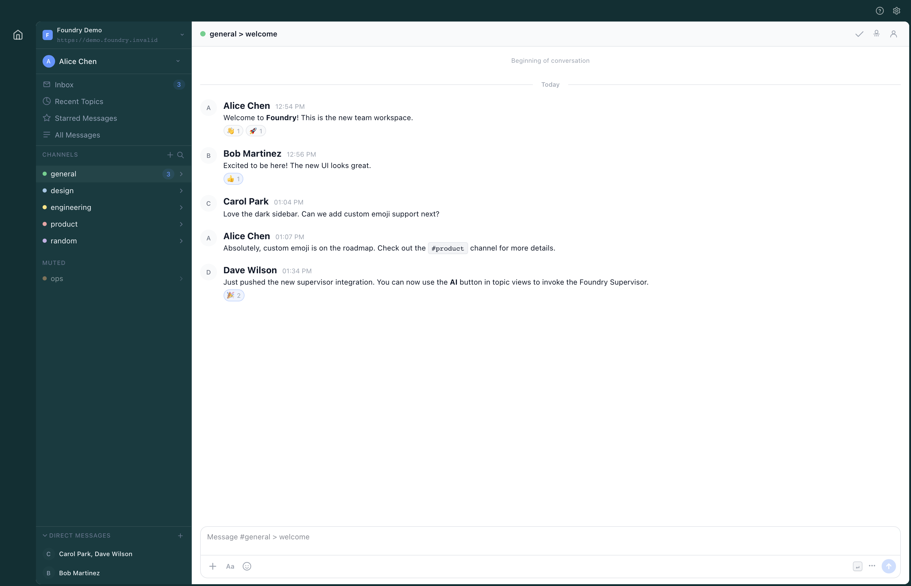

# Foundry

Foundry is a source-available desktop client and control-plane stack for GitHub-backed coding workflows. It combines a native collaboration surface, org provisioning, runtime policy, workspace orchestration, and desktop distribution into one product.

This repository contains the desktop app, the shared SolidJS UI packages, the Foundry Cloud control plane, the collaboration-core snapshot that powers the tenant app, and the infrastructure needed to run the stack.

## Product Snapshot



Foundry Desktop is the primary product surface: team conversation, supervisor guidance, delegated execution, and org-aware runtime context all live in the native app instead of a browser tab plus a pile of side tools.

## Control Plane Snapshot


Foundry Cloud uses the same SolidJS visual system as desktop so org setup, runtime defaults, GitHub binding, and workspace policy no longer sit behind a separate legacy admin UI.

## Why Foundry

- Native desktop collaboration instead of isolated terminal sessions and hidden local state.
- Shared supervisor-driven execution so work stays reviewable in context.
- One control plane for org provisioning, runtime providers, GitHub integration, and workspace policy.
- A self-hosting path for teams that want the full stack inside their own environment.

## Start Here

- Desktop builds: [GitHub Releases](https://github.com/aldrinc/foundry/releases)
- Setup docs: [docs/README.md](docs/README.md)
- Architecture overview: [docs/architecture/README.md](docs/architecture/README.md)
- Control-plane service: [services/foundry-server/README.md](services/foundry-server/README.md)

## What Ships In This Repo

| Path | Purpose |
| --- | --- |
| `packages/app` | Shared SolidJS product surface used by desktop |
| `packages/cloud` | SolidJS control-plane frontend that ships through Foundry Server |
| `packages/desktop` | Tauri shell, native bridge, packaging, and updater integration |
| `packages/ui` | Shared UI primitives and design building blocks |
| `services/foundry-server` | Control-plane APIs, auth, org management, GitHub, runtime, and workspace domains |
| `services/foundry-core` | Imported collaboration-core snapshot used by the tenant app |
| `infra` | Dev deploy scripts, Coder integration, and infrastructure templates |
| `docs` | Packaging, launch, architecture, and operational guidance |

## Get Foundry

Desktop installers are published through [GitHub Releases](https://github.com/aldrinc/foundry/releases).

Current release targets:

- macOS Apple Silicon and Intel
- Windows x64
- Linux `.deb` and `.rpm`

## Quickstart

From the repository root:

```bash
bun install
bun run test
bun run typecheck
bun run build
```

Useful follow-up commands:

```bash
bun run lint:eslint
bun run check:rust
bun run bundle:desktop:macos
cd services/foundry-server && python3 -m venv .venv
```

If you want local Git hooks enabled:

```bash
python3 -m pip install --user pre-commit
git config core.hooksPath .githooks
pre-commit install --hook-type pre-commit
```

## Documentation

- [docs/README.md](docs/README.md)
- [docs/faq.md](docs/faq.md)
- [docs/desktop-distribution.md](docs/desktop-distribution.md)
- [docs/desktop-ota-updates.md](docs/desktop-ota-updates.md)
- [docs/public-launch-checklist.md](docs/public-launch-checklist.md)
- [services/foundry-server/README.md](services/foundry-server/README.md)
- [services/foundry-core/README.md](services/foundry-core/README.md)

## Quality And Release Safety

Foundry uses layered checks before code ships:

- `pre-commit` for secrets, file hygiene, typos, Solid linting, and Rust formatting
- `.githooks/pre-push` for heavier TypeScript, Rust, and secret checks
- GitHub Actions CI in [.github/workflows/ci.yml](.github/workflows/ci.yml)
- Signed desktop release publishing in [.github/workflows/release-desktop.yml](.github/workflows/release-desktop.yml)

The secret scan lives in [scripts/check-secrets.sh](scripts/check-secrets.sh), with additional configuration in [.gitleaks.toml](.gitleaks.toml).

## Project Status

Foundry is in an early public release phase.

- Desktop release artifacts are published through GitHub Releases.
- The desktop updater path is wired through signed Tauri updater metadata.
- Foundry Cloud now ships as a SolidJS frontend on top of the server session and API layer.
- The public self-hosting path is still being standardized.

## Community

- [CONTRIBUTING.md](CONTRIBUTING.md)
- [SUPPORT.md](SUPPORT.md)
- [SECURITY.md](SECURITY.md)
- [CODE_OF_CONDUCT.md](CODE_OF_CONDUCT.md)

## License

Foundry-authored code in this repository is source-available under Elastic License 2.0. It is not an OSI open-source license. Component-level exceptions for imported third-party code are documented in [LICENSE](LICENSE) and [LICENSING.md](LICENSING.md).
