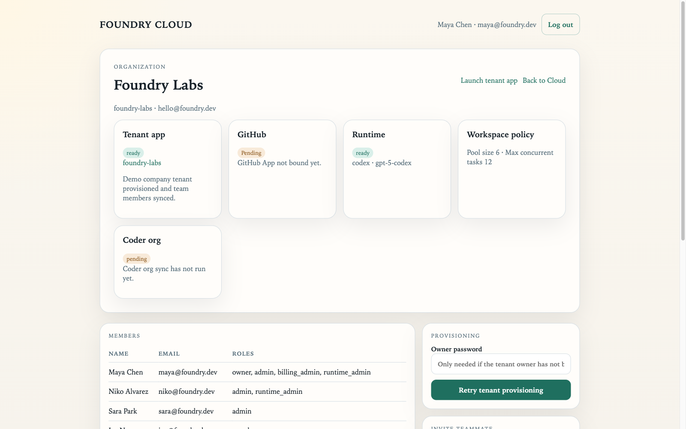
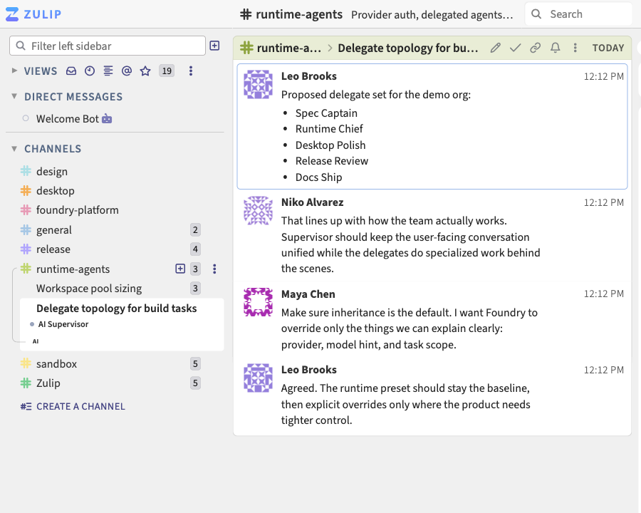

# Foundry

Foundry is a source-available desktop client and control-plane stack for GitHub-backed coding workflows. It brings together org provisioning, provider auth, runtime policy, workspace orchestration, and a collaboration-native product surface for teams shipping software with AI in the loop.

This repository includes the desktop app, shared UI packages, the Foundry control-plane service, the collaboration-core snapshot that powers the tenant app, and the infra needed to run the stack.

> Foundry-authored code is source-available under Elastic License 2.0. It is not an OSI open-source license. See [LICENSE](LICENSE) and [LICENSING.md](LICENSING.md).



## Why Foundry

- One place to configure organizations, runtime defaults, workspace policy, and provider access.
- A desktop client with native packaging, updater support, and local system integrations.
- Collaboration-first execution, where work stays visible in shared topics instead of disappearing into isolated terminals.
- A self-hosting path for teams that want the full product inside their own environment.

## Product Snapshot



The screenshots above were captured from the live demo dev stack and show the two halves of the product:

- Foundry Cloud for org setup, runtime policy, and workspace control.
- The tenant app for day-to-day collaboration, delegated work, and supervisor-driven execution.

## Architecture At A Glance

- `Foundry Cloud` is the control plane for organizations, memberships, provider auth, runtime defaults, and workspace policy.
- `Foundry Core` is the collaboration surface where teams coordinate work, review progress, and keep delivery visible.
- `Foundry Desktop` packages the product as a native app with local integrations and release distribution.

## What Ships In This Repo

| Path | Purpose |
| --- | --- |
| `packages/app` | Shared SolidJS application code used across the product surface |
| `packages/desktop` | Tauri desktop shell, native bridge, packaging, and updater integration |
| `packages/ui` | Shared UI primitives and design building blocks |
| `services/foundry-server` | Control-plane service for orgs, auth, GitHub, runtime, and workspace domains |
| `services/foundry-core` | Imported collaboration-core snapshot used by the tenant app |
| `infra` | Dev deploy scripts, coder integration, and infrastructure templates |
| `docs` | Packaging, architecture, FAQ, and launch guidance |

## Get Foundry

Desktop builds are published through [GitHub Releases](https://github.com/aldrinc/foundry/releases).

Current release targets:

- macOS Apple Silicon and Intel
- Windows x64
- Linux `.deb` and `.rpm`

## Quickstart

From the repository root:

```bash
bun install
bun run test
bun run typecheck
bun run build
bun run bundle:desktop
```

Useful follow-up commands:

```bash
bun run lint:eslint
bun run check:rust
bun run bundle:desktop:macos
cd services/foundry-server && pytest
```

If you want local hooks enabled:

```bash
python3 -m pip install --user pre-commit
git config core.hooksPath .githooks
pre-commit install --hook-type pre-commit
```

## Documentation

- [docs/README.md](docs/README.md)
- [docs/faq.md](docs/faq.md)
- [docs/desktop-distribution.md](docs/desktop-distribution.md)
- [docs/desktop-ota-updates.md](docs/desktop-ota-updates.md)
- [services/foundry-server/README.md](services/foundry-server/README.md)
- [services/foundry-core/README.md](services/foundry-core/README.md)

## Quality And Release Safety

Foundry uses layered checks before code ships:

- `pre-commit` for secrets, file hygiene, typos, Solid linting, and Rust formatting
- `.githooks/pre-push` for heavier TypeScript, Rust, and secret checks
- GitHub Actions CI in [.github/workflows/ci.yml](.github/workflows/ci.yml)
- Signed desktop release publishing in [.github/workflows/release-desktop.yml](.github/workflows/release-desktop.yml)

The secret scan lives in [scripts/check-secrets.sh](scripts/check-secrets.sh), with additional configuration in [.gitleaks.toml](.gitleaks.toml).

## Project Status

Foundry is in an early public release phase.

- Desktop release artifacts are published through GitHub Releases.
- The desktop updater path is wired through signed Tauri updater metadata.
- The server and infra layers are usable, but the public self-hosting path is still being standardized.
- The remaining launch work is tracked in [docs/public-launch-checklist.md](docs/public-launch-checklist.md).

## Community

- [CONTRIBUTING.md](CONTRIBUTING.md)
- [SUPPORT.md](SUPPORT.md)
- [SECURITY.md](SECURITY.md)
- [CODE_OF_CONDUCT.md](CODE_OF_CONDUCT.md)

## License

Foundry-authored code in this repository is released under Elastic License 2.0, with component-level exceptions for imported third-party code. See [LICENSE](LICENSE) and [LICENSING.md](LICENSING.md).
