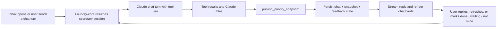

# Foundry Priority Inbox True Prototype Plan

Date: 2026-03-10
Status: Proposed

Related docs:

- [`foundry-priority-inbox-assistant-plan.md`](./foundry-priority-inbox-assistant-plan.md)
- [`foundry-priority-inbox-prototype-technical-plan.md`](./foundry-priority-inbox-prototype-technical-plan.md)

Related artifact:

- [`skills/priority-inbox-secretary/SKILL.md`](../../skills/priority-inbox-secretary/SKILL.md)

## Decision

The prototype should be a real agent-backed product demo, not a heuristic layer.

That means:

- no desktop-only ranking logic
- no topic-summary-first fallback
- no fake local "analysis" that only looks smart in screenshots
- no file-export validation path

The prototype should be one real server-side agent flow that:

- reads real Meridian dev data inside Foundry
- runs a real Claude chat session
- is configured as a skill with explicit tool access
- uses Claude tool calls, Files, and citations
- produces a structured priority snapshot with citations
- stores lightweight memory over time
- renders directly in a chat-style Inbox UI

## What Counts as a Successful Prototype

For one real user in the imported Meridian dev realm, the prototype must let the
user open Inbox and see:

- a secretary chat panel they can talk to
- a short list of likely important items
- a separate `Unclear` list when the agent is not confident
- a concise explanation of why each item surfaced
- clickable citations for every item
- persistent state when the user says `done`, `not mine`, or `waiting`

This prototype is successful if the user can inspect the output and say:

- "yes, this is reading the real material"
- "yes, I can see why it said this"
- "yes, it is surfacing useful work rather than noise"

## Prototype Boundary

### In scope

- Foundry Inbox UI
- Foundry-core chat endpoint and persisted assistant session
- real Claude Messages API call using Anthropic's native tool/files flow
- real Meridian dev data
- messages, transcripts, pasted text, and text attachments reachable from the
  user's accessible conversations
- citations and durable item state
- explicit `Unclear` output

### Out of scope

- heuristics as the primary decision layer
- multi-app connector expansion
- repo/code verification
- org-wide work graph
- autonomous follow-up execution
- large memory platform design

## Build Location

Build the first true prototype in `services/foundry-core/app`.

Reason:

- message ACLs already live there
- source gathering should happen server-side
- the current dev Meridian import already runs there
- we can reuse the native Claude chat/files implementation pattern from
  `mos/backend`

Repo anchors:

- Existing summary model call:
  [`services/foundry-core/app/zerver/actions/message_summary.py`](../../services/foundry-core/app/zerver/actions/message_summary.py)
- Existing summary endpoint:
  [`services/foundry-core/app/zerver/views/message_summary.py`](../../services/foundry-core/app/zerver/views/message_summary.py)
- Existing Inbox UI:
  [`packages/app/src/views/inbox.tsx`](../../packages/app/src/views/inbox.tsx)

## Core Product Shape

Treat this as a `secretary agent` with one job:

- review the user's recent accessible work context
- decide what is likely important
- separate low-confidence items into `Unclear`
- explain every surfaced item with evidence

The system should not pretend to know more than it does.

If the model is unsure, it must say so explicitly and keep the uncertainty
visible in the product.

The primary surface is a live secretary chat. The priority cards are a derived
artifact of that chat, not the entire experience.

The preferred implementation form is the
[`priority-inbox-secretary` skill](../../skills/priority-inbox-secretary/SKILL.md),
not an inbox-specific prompt buried in product code.

## Why Native Claude Instead of a Generic LLM Wrapper

For this prototype, use Anthropic's native Messages API and SDK rather than an
OpenAI-shaped compatibility layer.

Reason:

- the product needs a real chat session, not a one-shot completion
- the model needs first-class tool use for iterative source gathering
- large transcripts and plans fit cleanly through Claude Files and document
  blocks
- citations are a first-class requirement
- the `mos/backend` repo already contains direct Anthropic patterns we can
  reuse

See:

- [Anthropic Messages API](https://docs.anthropic.com/en/api/messages)
- [Anthropic tool use overview](https://docs.anthropic.com/en/docs/agents-and-tools/tool-use/overview)
- [Anthropic streaming messages](https://docs.anthropic.com/en/api/messages-streaming)
- [Anthropic Files](https://docs.anthropic.com/en/docs/build-with-claude/files)
- [Anthropic citations](https://docs.anthropic.com/en/docs/build-with-claude/citations)

## High-Level Request Flow

## Execution Path

### New endpoints

Add server endpoints in Foundry-core:

- `GET /api/v1/foundry/inbox/assistant/session`
- `POST /api/v1/foundry/inbox/assistant/chat/stream`
- `POST /api/v1/foundry/inbox/assistant/feedback`

Request model:

- current user only
- optional `session_id`
- user message text such as `Review my current work`
- optional `refresh=true`

Primary response path:

- SSE chat stream with assistant text and tool-progress events

Session payload:

- `session_id`
- `latest_snapshot`
- `recent_turns`
- `generated_at`

### Why this path

This keeps:

- ACL enforcement on the server
- transcript/file access on the server
- native Claude chat execution on the server
- traceability on the server

The client becomes a renderer, not the decision-maker.

## Source Collection

The only deterministic logic should be source collection and validation.

The server should build a bounded `source packet` set for the current user from:

- unread conversations
- recent home-view conversations
- recent direct messages
- recent messages in followed topics
- text attachments linked from those conversations
- transcript files linked from those conversations

The server should not decide "what matters" at this stage. It should only gather
candidate evidence the user is allowed to see.

### Source packet format

Each source packet should contain:

- `packet_id`
- `conversation_key`
- `source_type`
- `title`
- `message_ids`
- `text`
- `citations`

### Citation format

Each citation should contain:

- `citation_id`
- `message_id` or file anchor
- `source_url`
- `title`
- `excerpt`
- `captured_at`

### Transcript and file handling

For the prototype, only ingest text we can reliably fetch and cite:

- plain-text transcript files
- markdown files
- plain-text attachments
- pasted text in messages

Skip binary files in the first pass.

## Agent Design

Use one secretary skill, not three prompts and not a heuristic reducer.

The skill owns:

- the operating rules
- the required tool surface
- the Claude Files strategy
- the chat prompt contract
- the snapshot contract

The transport layer in Foundry-core should load and execute that skill through
the native Anthropic Messages API.

## Chat Contract

The secretary should behave like a real chat assistant:

- Foundry opens or resumes a session
- Claude receives the recent conversation history plus current user turn
- Claude uses tools to gather more evidence when needed
- Claude publishes a compact priority snapshot
- Claude ends the turn with a short assistant message

The detailed contract lives in
[`skills/priority-inbox-secretary/references/prompt-contract.md`](../../skills/priority-inbox-secretary/references/prompt-contract.md).

## Model Transport

Prototype choice:

- add a dedicated Anthropic-backed secretary chat action in Foundry-core
- call Anthropic's native Messages API server-side
- keep model choice configurable
- stream assistant output to the client

Recommended configuration:

- `ANTHROPIC_API_KEY`
- `CLAUDE_DEFAULT_MODEL`
- `FOUNDRY_PRIORITY_INBOX_MODEL`

Reuse:

- `mos/backend/app/routers/claude.py` for streamed chat shape
- `mos/backend/app/services/claude_files.py` for Files upload and validation

## Memory

Keep memory minimal and explicit.

Do not introduce a vector store or generalized agent memory system in v1.

### Required memory only

1. `priority_inbox_runs`
   - one row per agent run
   - stores prompt version, model, input hash, latest snapshot, and time

2. `priority_inbox_sessions`
   - one row per user chat session
   - stores current session id and last active time

3. `priority_inbox_turns`
   - recent user and assistant turns shown in the UI

4. `priority_inbox_items`
   - stable open/closed item records
   - stores current title, summary, status, confidence, and latest run linkage

5. `priority_inbox_citations`
   - normalized citation rows linked to items and runs

6. `priority_inbox_feedback`
   - user actions such as `done`, `waiting`, `not_mine`, `reopen`

### Why this memory is enough

This gives the prototype:

- persistence over time
- traceability
- inspectability
- reopen/close support
- a resumable chat UI

without creating a large memory platform before we validate the experience.

## Traceability Requirements

The UI must make it clear what the agent did.

Each item should show:

- title
- summary
- why it surfaced
- confidence
- clickable citations

Each run should also retain hidden-but-inspectable debug metadata:

- run id
- model
- prompt version
- session id
- packet ids considered
- published snapshot payload
- tool trace log

Do not expose chain-of-thought. Expose evidence and output structure only.

## UI Shape

Add a secretary chat panel to Inbox plus two groups:

- `Likely important`
- `Unclear`

The assistant reply should be short and streamed. The card lists persist as the
durable result of the turn.

Each card should include:

- short title
- short summary
- `Why this surfaced`
- 1-3 citation rows
- actions: `Open`, `Done`, `Waiting`, `Not mine`

This UI should be compact. The agent should save reading time, not add it.

## Verification in the Prototype

Do not build a separate deterministic verifier yet.

For the true prototype, verification should be:

- user-driven first
- model-assisted on subsequent refreshes

That means:

- user marks `done`
- next agent run sees prior item state plus new source evidence
- model either keeps it closed or reopens it with explanation

This is enough to validate whether the workflow is useful before investing in
codebase-aware or GitHub-aware verifiers.

## Implementation Steps

### 1. Server

- add Foundry-core secretary session model and chat action module
- add streamed chat endpoint
- add source-packet builder and Claude tool handlers
- add snapshot validation and persistence
- add tests around the native Anthropic transport boundary

### 2. Client

- replace current desktop analyzer call with secretary session + chat stream
- render recent assistant turns plus `priorities` and `unclear`
- show compact citations and feedback actions

### 3. Dev deployment

- deploy Foundry-core changes to the Meridian dev environment
- validate against `ac@meridian.cv`
- iterate on prompt and packet construction using real data

## Test Plan

### Automated

- unit tests for source packet building
- endpoint tests for ACL, tool handling, and snapshot validation
- Anthropic transport tests at the chat action boundary
- UI tests for chat streaming, grouped rendering, and feedback actions

### Manual

Use the imported Meridian dev environment and validate with the real user view:

- action topics surface correctly
- transcript-backed items show up with useful summaries
- uncertain transcript items land in `Unclear`
- each card has clickable citations
- `Done` and `Not mine` persist across refresh

## Explicit Rejections

This prototype should not:

- use heuristics to decide what matters
- hide weak results by inventing confidence
- summarize everything into one blob
- rely on local file exports
- stay desktop-only

## Recommendation

This should be the only prototype path we actively pursue now.

The heuristic desktop analyzer was useful to expose UI gaps, but it is the wrong
foundation. The next implementation pass should be the real server-side
secretary skill described here and in
[`skills/priority-inbox-secretary/SKILL.md`](../../skills/priority-inbox-secretary/SKILL.md).
