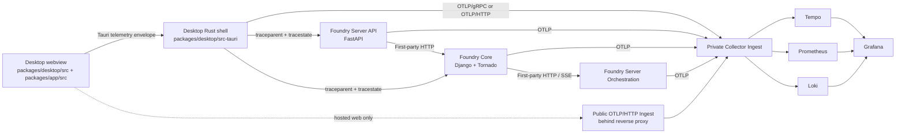

# Foundry Telemetry Specification

Date: 2026-03-19
Status: Draft for review (repo-specific revision)

## Purpose

Define a production telemetry strategy for Foundry that is:

- OSS-first
- OpenTelemetry-native
- privacy-preserving
- usable for both hosted and self-hosted deployments
- incremental from the current codebase rather than a rewrite
- robust for a stateful desktop collaboration product with offline periods, reconnects, long-lived sessions, background work, and multiple trust boundaries

This spec covers:

- the desktop webview UI built from [`packages/desktop/src/index.tsx`](../../packages/desktop/src/index.tsx) and [`packages/app/src/app.tsx`](../../packages/app/src/app.tsx)
- the desktop Rust/Tauri shell in [`packages/desktop/src-tauri`](../../packages/desktop/src-tauri)
- the FastAPI product backend and orchestration services in [`services/foundry-server/src/foundry_server`](../../services/foundry-server/src/foundry_server)
- the Django/Tornado backend in [`services/foundry-core/app`](../../services/foundry-core/app)

## Current Repo Baseline

Foundry is not starting from zero, but the telemetry surface is inconsistent.

### Desktop

- The Rust shell already uses `tracing`, but only for local logs through [`packages/desktop/src-tauri/src/logging.rs`](../../packages/desktop/src-tauri/src/logging.rs).
- The SolidJS webview has no telemetry bootstrap today.
- Tauri commands are generated through [`packages/desktop/src/bindings.ts`](../../packages/desktop/src/bindings.ts), which is the natural command boundary for correlation.
- Desktop lifecycle and platform seams already exist in [`packages/desktop/src/index.tsx`](../../packages/desktop/src/index.tsx): deep link handling, app version load, updater checks, storage flush, picker dialogs, drag-drop listeners, and native notifications.
- Stateful client behavior is concentrated in [`packages/app/src/context/zulip-sync.tsx`](../../packages/app/src/context/zulip-sync.tsx) and [`packages/app/src/context/supervisor.tsx`](../../packages/app/src/context/supervisor.tsx). Those files represent the real session-health surface for message hydration, unread state, reconnects, resync, supervisor streaming, and task control.
- Background realtime loops already exist in Rust:
  - [`packages/desktop/src-tauri/src/zulip/events.rs`](../../packages/desktop/src-tauri/src/zulip/events.rs) for the Zulip event queue
  - [`packages/desktop/src-tauri/src/zulip/supervisor_events.rs`](../../packages/desktop/src-tauri/src/zulip/supervisor_events.rs) for supervisor SSE
  - [`packages/desktop/src-tauri/src/codex_oauth.rs`](../../packages/desktop/src-tauri/src/codex_oauth.rs) for desktop OAuth callback handling

### Foundry Server

- [`services/foundry-server/src/foundry_server/app.py`](../../services/foundry-server/src/foundry_server/app.py) bootstraps FastAPI, but there is no structured tracing or metrics pipeline.
- The orchestration subsystem in [`services/foundry-server/src/foundry_server/orchestration/app.py`](../../services/foundry-server/src/foundry_server/orchestration/app.py) is the true application core for supervisor sessions, task lifecycle, plan synthesis, worker sessions, workspace prestart, provider auth, and integration policy, but it currently relies mostly on stdlib logging.
- Outbound dependency calls use `httpx`, `requests`, and internal client wrappers such as:
  - [`services/foundry-server/src/foundry_server/core_client.py`](../../services/foundry-server/src/foundry_server/core_client.py)
  - [`services/foundry-server/src/foundry_server/coder_client.py`](../../services/foundry-server/src/foundry_server/coder_client.py)
  - [`services/foundry-server/src/foundry_server/github_app.py`](../../services/foundry-server/src/foundry_server/github_app.py)
- Long-lived streaming and execution paths exist, but they are not modeled as traces today:
  - supervisor session SSE
  - task event SSE
  - Moltis/OpenCode RPC and run completion waits
  - workspace prestart and cleanup flows

### Foundry Core

- Foundry Core already has Sentry integration in [`services/foundry-core/app/zproject/sentry.py`](../../services/foundry-core/app/zproject/sentry.py).
- Foundry Core already has Prometheus-oriented operational monitoring and exporters in [`services/foundry-core/app/puppet/kandra/manifests`](../../services/foundry-core/app/puppet/kandra/manifests).
- Foundry-specific Django endpoints are concentrated in:
  - [`services/foundry-core/app/zerver/views/foundry_tasks.py`](../../services/foundry-core/app/zerver/views/foundry_tasks.py)
  - [`services/foundry-core/app/zerver/views/foundry_cloud.py`](../../services/foundry-core/app/zerver/views/foundry_cloud.py)
  - [`services/foundry-core/app/zerver/views/message_summary.py`](../../services/foundry-core/app/zerver/views/message_summary.py)
- Foundry Core is not only an app server; it is also a proxy and compatibility edge:
  - `_orchestrator_request` and `_orchestrator_stream_response` in `foundry_tasks.py` proxy to Foundry orchestration
  - `_foundry_server_request` in `foundry_tasks.py` proxies inbox assistant traffic to `foundry-server`
  - `/json/foundry/*` and `/json/meridian/*` both remain live compatibility surfaces
- Core already records request-duration and performance-oriented log data in [`services/foundry-core/app/zerver/middleware.py`](../../services/foundry-core/app/zerver/middleware.py). Migration must preserve that operational value.

## Goals

- Produce one correlated trace for critical desktop flows from webview interaction through Rust commands into backend services.
- Standardize new instrumentation on OpenTelemetry and OTLP.
- Keep telemetry collection non-blocking and fail-open.
- Avoid vendor lock-in in application code.
- Support OSS storage and visualization for traces, metrics, and logs.
- Protect user content and secrets by default.
- Make telemetry usable for product debugging, runtime operations, release validation, and client-session health.
- Make trust boundaries explicit so correlation works across first-party services without leaking context or sensitive metadata to third parties.

## Non-Goals

- content analytics on message bodies, prompts, attachments, or document text
- shipping secrets or auth headers into telemetry
- always-on verbose debug logging in production
- introducing a desktop sidecar collector unless direct OTLP export proves insufficient
- replacing every existing Foundry Core metric on day one
- using telemetry as a substitute for product analytics or growth instrumentation

## Maturity and Platform Constraints

Foundry will adopt OpenTelemetry with platform-specific caution rather than assuming every runtime is equally mature. As of the current documentation, JavaScript traces and metrics are stable while JS logs remain in development; browser client instrumentation is still experimental and mostly unspecified; Python traces and metrics are stable while Python logs remain in development; the Python contrib instrumentation packages still describe themselves as beta and not generally suitable for production; Rust remains beta across traces, metrics, and logs. This spec therefore requires version pinning, explicit instrumentation kill switches, narrow browser auto-instrumentation, and staged rollout of contrib packages instead of blanket enablement. ([OpenTelemetry][1], [OpenTelemetry][26])

## Design Principles

### 1. OpenTelemetry is the application standard

All new telemetry emitted from Foundry application code should use OpenTelemetry APIs and SDKs. Export format should be OTLP so storage backends can change without rewriting instrumentation. OTLP itself is stable for traces, metrics, and logs. ([OpenTelemetry][23])

### 2. The collector is the control point

Applications should emit OTLP to an OpenTelemetry Collector gateway. The collector is where Foundry applies batching, memory protection, filtering, enrichment, optional tail sampling, routing, and backend fan-out. The Collector gateway pattern is the recommended way to send signals first to a central OTLP endpoint and then to downstream backends. ([OpenTelemetry][2])

### 3. Client-app constraints are first-class

Desktop and browser telemetry are not just smaller versions of server telemetry. Client apps have resource constraints, intermittent connectivity, session continuity, privacy and consent concerns, and large user populations that make sampling and buffering core design concerns. Foundry must treat session management, offline behavior, reconnects, and UI responsiveness as primary telemetry requirements. ([OpenTelemetry][3])

### 4. Privacy and redaction are product requirements

Telemetry must follow data minimization. Prompt text, message content, attachment content, emails, tokens, cookies, and similar data are excluded by default. OpenTelemetry’s security guidance explicitly frames sensitive-data handling as the implementer’s responsibility and recommends collecting only data that serves an observability purpose. ([OpenTelemetry][4])

### 5. Telemetry must fail open

Telemetry export must never block UI rendering, message sending, login, event polling, background sync, or server request handling. Collector or backend outages should reduce observability, not product availability. The Collector’s resiliency model is built around sending queues, retries, and bounded buffering, and Foundry should mirror that philosophy in SDK configuration and local logging. ([OpenTelemetry][5])

### 6. Trust boundaries are explicit

OpenTelemetry context propagation is valuable, but it is not free of privacy or architectural risk. W3C Trace Context says `traceparent` and `tracestate` exist only for trace correlation and must not carry sensitive information, while W3C Baggage and OTel baggage guidance warn that baggage may carry sensitive information and can be propagated unintentionally to third parties. Foundry will therefore distinguish first-party propagation from third-party calls and will keep baggage off by default. ([W3C][6], [OpenTelemetry][27])

## Recommended OSS Stack

### Application SDKs

- Desktop webview: OpenTelemetry JavaScript Web SDK
- Desktop Rust shell: `tracing` + `tracing-opentelemetry` + OTLP exporter crates
- Foundry Server: OpenTelemetry Python SDK plus targeted contrib instrumentors
- Foundry Core: OpenTelemetry Python SDK plus targeted Django/dependency instrumentors, introduced alongside existing Sentry and Prometheus coverage

### Collection

- OpenTelemetry Collector as the standard ingress and processing layer

### Storage and Visualization

- Traces: Grafana Tempo OSS
- Metrics: Prometheus OSS in phase 1
- Logs: Grafana Loki OSS once remote log export is enabled
- Dashboards and correlation: Grafana OSS

### Why this stack

The stack stays vendor-neutral in code, matches the OTLP ecosystem, and lines up with Tempo’s ability to derive RED metrics and service graphs from traces, Prometheus’s OTLP support, and Loki’s native OTLP log ingestion. It also fits Foundry Core’s existing Prometheus and Sentry posture better than a clean-slate replacement would. ([Grafana Labs][7], [Prometheus][15], [Grafana Labs][20])

## Service Model and Identity

Foundry should not report everything as one service. Use a small, explicit service namespace.

Rule:

- one deployable process maps to one `service.name`
- logical subdomains inside a process use attributes such as `foundry.component`

### Required resource attributes

- `service.namespace=foundry`
- `service.name`
- `service.version`
- `deployment.environment.name`
- `service.instance.id`

### Additional Foundry identity attributes

- `foundry.installation.id`
- `foundry.release.channel`
- `foundry.app.session.id`
- `foundry.org_id_hash`
- `foundry.realm_host`

`service.instance.id` must not be used as the stable desktop installation identifier. OpenTelemetry requires `service.instance.id` to be unique per running instance of a given `service.namespace,service.name` pair. It is for distinguishing concurrently running instances, not for permanent installation identity. Foundry should therefore use a separate stable pseudonymous identifier such as `foundry.installation.id`, while `service.instance.id` remains process-scoped. ([OpenTelemetry][8])

### Session identity rules

- `foundry.app.session.id` is a rotating pseudonymous identifier for one app session
- it is allowed on spans and logs
- it is prohibited as a metric label
- it should reset on full restart and may reset after long suspend/resume windows if that improves session semantics

### Recommended service names

- `foundry-desktop-web`
- `foundry-desktop-rust`
- `foundry-server-api`
- `foundry-server-orchestration`
- `foundry-core-django`
- `foundry-core-tornado`
- `foundry-core-worker`

If the API shell and orchestration app are ever co-deployed as one process, collapse them to `foundry-server` and preserve the split with `foundry.component=api|orchestration`.

### Recommended component attribute values

- `foundry.component=desktop-webview`
- `foundry.component=desktop-shell`
- `foundry.component=sync`
- `foundry.component=supervisor`
- `foundry.component=api`
- `foundry.component=orchestration`
- `foundry.component=realtime`
- `foundry.component=cloud-control-plane`
- `foundry.component=worker`

### Environment names

- `local`
- `staging`
- `production`

## Instrumentation Scope and Schema Governance

Foundry instrumentation must be versioned as telemetry contracts, not just code. OpenTelemetry defines instrumentation scope as the `(name, version, schema_url, attributes)` tuple associated with emitted telemetry, and schema URLs exist specifically so semantic-convention evolution does not silently break downstream dashboards and alerts. ([OpenTelemetry][9])

Requirements:

- every Foundry manual instrumentation package sets a stable instrumentation scope name and version
- Foundry manual instrumentation includes a schema URL when feasible
- new `foundry.*` attributes require review and owner assignment
- dashboards and alerts must target a documented schema version
- changes to metric labels, span names, or custom attributes require migration notes

Recommended scope names:

- `foundry.desktop.web`
- `foundry.desktop.rust`
- `foundry.server.api`
- `foundry.server.orchestration`
- `foundry.core.django`
- `foundry.core.tornado`

## Topology

### Default production topology

- desktop webview creates spans and selected metrics
- desktop Rust is the default exporter for bundled desktop telemetry
- desktop Rust forwards backend HTTP requests with W3C trace context to first-party Foundry services
- desktop Rust exports OTLP to a collector ingress
- Foundry Server API, Foundry Server orchestration, and Foundry Core export OTLP to private collector ingress
- collector routes traces to Tempo, metrics to Prometheus-compatible storage, and logs to Loki

### Public and private ingest split

Hosted Foundry should use two collector-facing ingress classes:

- public ingest for browser-originated or internet-reachable telemetry
- private ingest for server-side services and trusted desktop Rust export

This split keeps browser-specific constraints such as reverse proxying, CSP, CORS, internet exposure, and tighter auth controls separate from internal service pipelines. OTel’s browser exporter guidance explicitly notes that browser OTLP export cannot use gRPC, requires CSP/CORS handling, and should not expose the collector directly without a reverse proxy in front of it. ([OpenTelemetry][10])

### Desktop transport profiles

#### Profile A: bundled desktop app

Default for the Tauri product:

- webview creates spans and metrics
- webview sends context to Rust over Tauri `invoke`
- Rust becomes the default remote-export path for desktop traces and metrics
- browser-side direct OTLP is disabled by default

Rationale: Tauri commands are the natural typed boundary between the webview and Rust, and using Rust as the primary exporter avoids public collector exposure, browser CORS/CSP issues, and browser-only transport limits for the desktop product. Tauri’s command system is explicitly designed as the frontend-to-Rust IPC boundary. ([Tauri][11])

#### Profile B: hosted web app

Only for pure web deployment:

- browser exports via OTLP/HTTP only
- browser OTLP must go through a reverse proxy or equivalent ingress
- CSP and CORS must be configured explicitly
- gRPC export is not allowed

Browser OTLP over HTTP is feasible, but OTel JS exporter guidance requires OTLP/HTTP rather than gRPC and calls out CSP, CORS, and collector exposure concerns. ([OpenTelemetry][10])

## Context Propagation Standard

### Cross-boundary rule

Critical user-facing flows must preserve W3C trace context across:

- SolidJS webview to Tauri invoke
- Tauri Rust to first-party HTTP requests
- backend ingress to downstream first-party dependencies
- background jobs, queues, and stream-driven workflows

### Trust-boundary propagation matrix

| Boundary | Examples | `traceparent` | `tracestate` | `baggage` |
| --- | --- | --- | --- | --- |
| First-party Foundry services | desktop Rust -> Foundry Server, Foundry Server -> Foundry Core, Foundry Core -> orchestrator | forward | forward | off by default |
| Trusted private infrastructure | internal API gateway, private queue, internal collector relay | forward | preserve when useful | opt-in allowlist only |
| Third-party SaaS and public APIs | GitHub, OAuth providers, Anthropic/OpenAI, external Coder if separately operated | do not forward by default | do not forward by default | never by default |

Policy notes:

- Third-party calls still get local CLIENT spans.
- If correlation across a third-party boundary is ever required, prefer starting a new trace at the boundary rather than forwarding internal trace state indiscriminately.
- Baggage remains off unless a specific internal use case survives privacy review. ([W3C][6], [OpenTelemetry][27])

### Desktop webview to Rust

This is the most important custom integration because Tauri `invoke` is not standard HTTP.

Required design:

1. The webview creates a span around the user action or command.
2. The webview injects `traceparent` and `tracestate` into a telemetry envelope attached to every command invocation.
3. Rust extracts that context and sets the Rust span parent explicitly.
4. Rust outbound first-party HTTP requests carry the current context through standard headers.

Required envelope fields:

- `traceparent`
- `tracestate`
- `command_name`
- `command_group`
- `feature`
- `session_id`

Implementation notes:

- use a handwritten wrapper in the desktop layer rather than editing generated files in [`packages/desktop/src/bindings.ts`](../../packages/desktop/src/bindings.ts)
- in Rust, set the extracted parent context explicitly at command entry

### Initial document-load correlation

If Foundry is deployed as a hosted web app, server-rendered HTML should set the initial `traceparent` in the page template so browser document-load tracing joins the server request that served the page. The current OTel browser guidance shows this pattern explicitly with a `traceparent` meta tag. ([OpenTelemetry][12])

### Background work

When work continues asynchronously after the originating request or user action has ended:

- use PRODUCER and CONSUMER spans when work is queued or streamed
- persist the initiating context when the transport naturally supports it
- otherwise create a new trace and add a span link to the initiating context
- do not fake parent-child nesting when the work is detached, retried later, or processed independently

OTel’s trace model and messaging semantics treat producer/consumer spans and span links as the correct way to model detached and asynchronous causal relationships. ([OpenTelemetry][13])

### Long-lived stream rule

Foundry has several long-lived channels: Zulip event polling, supervisor SSE, task SSE, and desktop session lifetime. Those should not be modeled as single multi-hour spans.

Required modeling:

- one span per connect attempt
- one span per long-poll request or SSE session
- one span per reconnect/backoff cycle
- one span per explicit resync or replay
- separate counters and gauges for steady-state health

This keeps traces queryable and prevents enormous spans from becoming the only representation of realtime health.

## Signal Policy

### Desktop webview

Phase 1:

- manual traces for key user flows
- document-load instrumentation only if it is useful and quiet
- minimal product and reliability metrics
- no remote browser log export
- direct browser OTLP disabled for bundled desktop

### Desktop Rust shell

Phase 1:

- traces
- metrics
- structured local JSON logs with trace and span correlation
- remote OTLP export for traces and metrics

Phase 2:

- optional remote warn/error logs after redaction and volume review

### Foundry Server

Phase 1:

- traces
- metrics
- logging correlation
- targeted dependency instrumentation only

Phase 2:

- remote OTLP logs
- expanded async/worker instrumentation

### Foundry Core

Phase 1:

- Django ingress tracing
- Tornado/realtime tracing
- dependency tracing
- current Prometheus metrics remain in place
- current Sentry remains in place

Phase 2:

- remote OTLP logs where useful
- review any Sentry reduction only after parity is demonstrated

### Transport guidance

OpenTelemetry JS browser exporters support OTLP/HTTP but not gRPC, and browser export requires CSP/CORS and public collector exposure or a reverse proxy. Therefore Foundry should keep the same trace model across hosted-web and desktop-webview modes, but default to Rust-mediated export in the desktop bundle instead of weakening the correlation model to fit browser transport constraints. ([OpenTelemetry][10])

## Span Naming and Attribute Rules

### Naming rules

- use `domain.action` or `domain.subdomain.action`
- names must describe the logical operation, not the implementation detail
- prefer route templates over raw URLs
- do not encode IDs into span names
- use one root span per user action, request, poll attempt, or stream session

Examples:

- `auth.login`
- `messages.fetch`
- `supervisor.message.send`
- `foundry.server.organization.provision`
- `foundry.core.orchestrator.http`
- `zulip.event_queue.poll`

### Required common attributes

- `foundry.surface`
- `foundry.feature`
- `foundry.component`
- `foundry.command` when a Tauri or RPC command boundary is crossed
- `foundry.org_id_hash` when an org/realm context exists
- `foundry.realm_host` when a realm host exists
- `deployment.environment.name`
- `service.version`

### Error rules

- set span status on failure
- use `error.type` for machine-readable classification
- use `error.message` only when already redacted and low-risk
- do not attach raw exception payloads or response bodies by default
- follow current semantic-convention guidance around recording exceptions instead of inventing custom event shapes. ([OpenTelemetry][28])

### High-cardinality rule

The following may appear on spans and logs but must never become metric labels:

- `foundry.installation.id`
- `foundry.app.session.id`
- `task.id`
- `worker_session.id`
- `topic_scope_id`
- `workspace.id`
- `user.id_hash`
- `request.id`

## Required Client Session and Lifecycle Coverage

Foundry is a desktop collaboration app, so telemetry must cover lifecycle and sync health in addition to user actions. OTel’s client-app guidance explicitly calls out session management, page/screen load performance, user interactions, errors/crashes, resource loading, network variability, privacy, and sampling as core client observability concerns. ([OpenTelemetry][3])

### Required lifecycle spans

- `app.cold_start`
- `app.warm_start`
- `app.resume`
- `app.suspend`
- `app.shutdown`
- `app.update.check`
- `app.update.download`
- `app.update.apply`
- `app.restart_after_update`
- `webview.reload`
- `webview.crash` as a log-first event, optionally with a trace link when context exists
- `deep_link.handle`
- `network.offline`
- `network.online`
- `event_queue.connect`
- `event_queue.disconnect`
- `event_queue.reconnect`
- `event_queue.backoff`
- `event_queue.resync`
- `cache.open`
- `cache.migrate`
- `cache.rebuild`

### Required UX and sync metrics

- `foundry.desktop.startup.duration`
- `foundry.desktop.first_shell_visible.duration`
- `foundry.desktop.first_message_list_ready.duration`
- `foundry.desktop.supervisor_panel_ready.duration`
- `foundry.desktop.event_queue.reconnects`
- `foundry.desktop.event_queue.disconnects`
- `foundry.desktop.event_queue.backoff.duration`
- `foundry.desktop.event_queue.resync.duration`
- `foundry.desktop.sync.lag`
- `foundry.desktop.event_queue.poll.duration`
- `foundry.desktop.supervisor.poll.duration`
- `foundry.desktop.notification.enqueue_to_play.duration`
- `foundry.desktop.ui.long_task.duration`
- `foundry.desktop.webview.reloads`
- `foundry.desktop.cache.migration.duration`

### Required low-cardinality client resource attributes

- `service.version`
- `foundry.release.channel`
- `os.type`
- `os.version`
- `webengine.name`
- `webengine.version`
- `deployment.environment.name`

Span-only, never metric labels:

- `foundry.installation.id`
- `foundry.app.session.id`
- `workspace.id`
- `task.id`
- `session.id`
- `user.id_hash`

## Application-Specific Tracing Catalog

This section replaces generic “HTTP + DB + queue” advice with the actual Foundry flows that need observability.

### Desktop webview bootstrap and product flows

#### Bootstrap and platform surface

Source files:

- [`packages/desktop/src/index.tsx`](../../packages/desktop/src/index.tsx)
- [`packages/app/src/app.tsx`](../../packages/app/src/app.tsx)
- [`packages/app/src/auto-update-scheduler.ts`](../../packages/app/src/auto-update-scheduler.ts)

Required spans:

- `app.start`
- `app.mount`
- `app.version.load`
- `deep_link.listener.init`
- `deep_link.handle`
- `auth.auto_login`
- `auth.login`
- `auth.logout`
- `org.switch`
- `desktop.update.check`
- `desktop.update.prompt.show`
- `desktop.update.install`
- `desktop.storage.flush`
- `desktop.directory_picker.open`
- `desktop.file_picker.open`
- `desktop.drag_drop.listener.register`
- `desktop.notification.enqueue`
- `desktop.notification.play_sound`

Required metrics:

- `foundry.desktop.startup.duration`
- `foundry.desktop.first_shell_visible.duration`
- `foundry.desktop.update.check.duration`
- `foundry.desktop.notification.enqueue_to_play.duration`
- `foundry.desktop.storage.flush.duration`

Required attributes:

- `foundry.surface=desktop`
- `foundry.feature=bootstrap|auth|updates|notifications`
- `foundry.release.channel`
- `foundry.realm_host` when authenticated

#### Server discovery, sign-in, and SSO

Primary source files:

- [`packages/app/src/views/login.tsx`](../../packages/app/src/views/login.tsx)
- [`packages/app/src/views/settings-servers.tsx`](../../packages/app/src/views/settings-servers.tsx)
- [`packages/app/src/zulip-auth.ts`](../../packages/app/src/zulip-auth.ts)

Required spans:

- `auth.server_settings.fetch`
- `auth.api_key.exchange`
- `auth.login`
- `auth.sso.start`
- `auth.sso.callback`
- `auth.sso.complete`
- `server.save`
- `server.remove`

Required metrics:

- `foundry.desktop.auth.duration`
- `foundry.desktop.auth.failures`
- `foundry.desktop.sso.completions`
- `foundry.desktop.saved_servers.count`

Required notes:

- pending-SSO local state and deep-link callbacks are part of the auth trace, not separate anonymous logs
- auth-invalid disconnect recovery should emit `auth.invalid_session.recover`

#### Zulip sync state machine

Primary source file:

- [`packages/app/src/context/zulip-sync.tsx`](../../packages/app/src/context/zulip-sync.tsx)

The sync layer is not just a message fetch client. It owns queue connectivity, unread integrity, topic hydration, and the transition between connected and degraded session states.

Required spans:

- `sync.session.connected`
- `sync.session.disconnected`
- `messages.ensure`
- `stream_topics.ensure`
- `messages.mark_read`
- `stream.mark_read`
- `topic.mark_read`
- `message_event.apply`
- `reaction_event.apply`
- `subscription_event.apply`
- `message_update.apply`
- `message_delete.apply`
- `flag_update.apply`
- `user_topic_event.apply`
- `sync.resync.apply`
- `notification.decide`

Required metrics:

- `foundry.desktop.messages.ensure.duration`
- `foundry.desktop.stream_topics.ensure.duration`
- `foundry.desktop.sync.resync.duration`
- `foundry.desktop.sync.lag`
- `foundry.desktop.unread_state.rebuilds`
- `foundry.desktop.event_queue.disconnects`

Required notes:

- `ensureMessages` and `ensureStreamTopics` should distinguish cache-hit, stale-refresh, and forced-refresh behavior with low-cardinality attributes such as `foundry.cache_result=hit|miss|refresh`.
- `handleResync` must record whether the resync was triggered by queue expiry, auth failure, replay gap, or explicit reconnect.
- Notification decisions should log only the decision path, never message content.

#### Supervisor state machine and composer

Primary source files:

- [`packages/app/src/context/supervisor.tsx`](../../packages/app/src/context/supervisor.tsx)
- [`packages/app/src/components/supervisor/supervisor-composer.tsx`](../../packages/app/src/components/supervisor/supervisor-composer.tsx)
- [`packages/app/src/views/settings-agents.tsx`](../../packages/app/src/views/settings-agents.tsx)

Required spans:

- `supervisor.open_for_topic`
- `supervisor.session.select`
- `supervisor.session.start`
- `supervisor.message.send`
- `supervisor.task.control`
- `supervisor.clarification.reply`
- `supervisor.stream.attach`
- `supervisor.stream.poll_fallback`
- `supervisor.upload.pick`
- `supervisor.upload.drag_drop`
- `supervisor.upload.paste`
- `supervisor.upload.temp_file.save`
- `supervisor.provider.catalog.load`
- `supervisor.provider.connect`
- `supervisor.provider.disconnect`
- `supervisor.provider.oauth.start`
- `supervisor.provider.oauth.complete`

Required metrics:

- `foundry.desktop.supervisor_panel_ready.duration`
- `foundry.desktop.supervisor.message.duration`
- `foundry.desktop.supervisor.stream.reconnects`
- `foundry.desktop.supervisor.poll_fallback.activations`
- `foundry.desktop.supervisor.upload.count`
- `foundry.desktop.supervisor.upload.bytes`

Required notes:

- `SUPERVISOR_FALLBACK_WARNING` in `supervisor.tsx` is a user-visible degradation mode and must have a matching metric plus span event when activated.
- `sendMessage`, `controlTask`, and `replyToClarification` should each open a root user-action span in the webview before invoking Rust.
- Upload tracing must record count, MIME class, and size bucket only. It must not record attachment names or content.

#### Message list and read-path UX

Primary source file:

- [`packages/app/src/components/message-list.tsx`](../../packages/app/src/components/message-list.tsx)

Required spans:

- `message_list.initial_load`
- `message_list.fetch_older`
- `message_list.mark_visible_read`
- `message_list.mark_topic_read`
- `message_list.mark_stream_read`
- `message_list.open_supervisor`

Required metrics:

- `foundry.desktop.first_message_list_ready.duration`
- `foundry.desktop.message_list.fetch_older.duration`
- `foundry.desktop.message_list.mark_read.duration`

#### Inbox assistant and review queue flows

Primary source files:

- [`packages/app/src/views/inbox/inbox-view.tsx`](../../packages/app/src/views/inbox/inbox-view.tsx)
- [`packages/desktop/src-tauri/src/commands.rs`](../../packages/desktop/src-tauri/src/commands.rs)

Required spans:

- `inbox.assistant.session.load`
- `inbox.assistant.bootstrap`
- `inbox.assistant.message.send`
- `inbox.assistant.feedback.record`
- `inbox.assistant.open_item`

Required metrics:

- `foundry.desktop.inbox_assistant.load.duration`
- `foundry.desktop.inbox_assistant.feedback.count`
- `foundry.desktop.inbox_assistant.bootstrap.count`

#### Compose, uploads, downloads, previews, and GIF search

Primary source files:

- [`packages/app/src/components/compose-box.tsx`](../../packages/app/src/components/compose-box.tsx)
- [`packages/app/src/components/message-item.tsx`](../../packages/app/src/components/message-item.tsx)
- [`packages/app/src/components/link-preview-card.tsx`](../../packages/app/src/components/link-preview-card.tsx)
- [`packages/app/src/components/compose-actions.ts`](../../packages/app/src/components/compose-actions.ts)

Required spans:

- `compose.typing.start`
- `compose.typing.stop`
- `compose.upload.pick`
- `compose.upload.save_temp`
- `compose.upload.size_check`
- `compose.upload.send`
- `message.send`
- `message.edit`
- `message.reaction.toggle`
- `message.download`
- `link_preview.fetch`
- `gif.search`

Required metrics:

- `foundry.desktop.upload.bytes`
- `foundry.desktop.upload.duration`
- `foundry.desktop.upload.failures`
- `foundry.desktop.download.bytes`
- `foundry.desktop.download.duration`
- `foundry.desktop.message_send.duration`
- `foundry.desktop.link_preview.duration`
- `foundry.desktop.gif_search.duration`

Required notes:

- arbitrary preview URLs and Giphy/Tenor searches are third-party boundaries and must never receive Foundry trace headers

#### Notifications, presence, settings, and window lifecycle

Primary source files:

- [`packages/app/src/context/presence.tsx`](../../packages/app/src/context/presence.tsx)
- [`packages/app/src/context/settings.tsx`](../../packages/app/src/context/settings.tsx)
- [`packages/desktop/src-tauri/src/lib.rs`](../../packages/desktop/src-tauri/src/lib.rs)
- [`packages/desktop/src/menu.ts`](../../packages/desktop/src/menu.ts)

Required spans:

- `notification.permission.check`
- `notification.send`
- `badge.update`
- `presence.fetch`
- `presence.update_active`
- `settings.local.load`
- `settings.capabilities.load`
- `settings.zulip.load`
- `settings.local.persist`
- `settings.desktop.sync`
- `settings.zulip.sync`
- `desktop.window.init`
- `desktop.window.close_intercept`
- `desktop.window.hide_to_tray`
- `desktop.tray.click`
- `desktop.menu.trigger`
- `desktop.single_instance.focus`

Required metrics:

- `foundry.desktop.notification.sent`
- `foundry.desktop.notification.permission_denied`
- `foundry.desktop.badge.unread`
- `foundry.desktop.presence.poll.duration`
- `foundry.desktop.presence.active_updates`
- `foundry.desktop.settings.load.duration`
- `foundry.desktop.settings.persist.failures`
- `foundry.desktop.window.hide_to_tray.count`

### Desktop Rust shell and Tauri boundary

#### Global command boundary

Primary source files:

- [`packages/desktop/src-tauri/src/lib.rs`](../../packages/desktop/src-tauri/src/lib.rs)
- [`packages/desktop/src-tauri/src/commands.rs`](../../packages/desktop/src-tauri/src/commands.rs)
- [`packages/desktop/src-tauri/src/supervisor_commands.rs`](../../packages/desktop/src-tauri/src/supervisor_commands.rs)

Required design:

- every Tauri command must pass through one common tracing wrapper
- the wrapper extracts parent context from the invoke envelope
- the wrapper creates a Rust SERVER span named for the logical command
- the wrapper injects context into downstream `reqwest` requests
- the wrapper also emits a child `tauri.invoke` span tagged with `foundry.command`

Required wrapper attributes:

- `foundry.command`
- `foundry.command_group`
- `foundry.org_id_hash` when present
- `foundry.surface=desktop`
- `foundry.component=desktop-shell`

Required command groups:

- `auth`
- `messages`
- `realtime`
- `supervisor`
- `settings`
- `files`
- `admin`

#### Auth, session, and local desktop services

Primary source files:

- [`packages/desktop/src-tauri/src/commands.rs`](../../packages/desktop/src-tauri/src/commands.rs)
- [`packages/desktop/src-tauri/src/server.rs`](../../packages/desktop/src-tauri/src/server.rs)
- [`packages/desktop/src-tauri/src/codex_oauth.rs`](../../packages/desktop/src-tauri/src/codex_oauth.rs)

Required spans:

- `auth.server_settings.get`
- `auth.login`
- `auth.fetch_api_key`
- `auth.external_window.open`
- `auth.sso.callback`
- `auth.logout`
- `desktop.servers.load`
- `desktop.servers.add`
- `desktop.servers.remove`
- `desktop.settings.load`
- `desktop.settings.save`
- `desktop.updater.config_check`
- `desktop.badge.set`
- `desktop.notification.sound.play`
- `provider.codex.oauth.browser`
- `provider.codex.oauth.callback.listen`
- `provider.codex.oauth.token.exchange`

Required metrics:

- `foundry.desktop.auth.login.duration`
- `foundry.desktop.auth.fetch_api_key.duration`
- `foundry.desktop.settings.save.errors`
- `foundry.desktop.oauth.callback.timeout`

Required notes:

- `connect_with_api_key` in `commands.rs` is a key correlation boundary because it validates credentials, registers the event queue, and spawns background work. It needs child spans for each step.
- OAuth callback spans must never record raw callback URLs, codes, or tokens.

#### Zulip and desktop command surface

Primary source files:

- [`packages/desktop/src-tauri/src/commands.rs`](../../packages/desktop/src-tauri/src/commands.rs)
- [`packages/desktop/src-tauri/src/zulip/api.rs`](../../packages/desktop/src-tauri/src/zulip/api.rs)

The command wrapper covers the whole API surface, but the following operations require named child spans because they are user-visible and dominate support/debugging time:

- `messages.fetch`
- `messages.summary`
- `messages.send`
- `messages.edit`
- `messages.delete`
- `reactions.add`
- `reactions.remove`
- `presence.update`
- `typing.send`
- `files.temp.save`
- `files.download`
- `files.upload`
- `media.authenticated.fetch`
- `snippets.list`
- `snippets.create`
- `snippets.update`
- `snippets.delete`
- `call_link.create`
- `message_flags.update`
- `stream.mark_read`
- `topic.mark_read`
- `stream_topics.get`
- `stream.subscribe`
- `stream.unsubscribe`
- `subscription.properties.update`
- `topic.visibility.update`
- `topic.move`
- `topic.resolve`
- `user_settings.update`
- `user_settings.get`
- `avatar.upload`
- `avatar.delete`
- `link_preview.fetch`

Required metrics:

- `foundry.desktop.command.duration`
- `foundry.desktop.command.errors`
- `foundry.desktop.file.download.duration`
- `foundry.desktop.file.upload.duration`
- `foundry.desktop.link_preview.duration`

#### Supervisor command and API surface

Primary source files:

- [`packages/desktop/src-tauri/src/supervisor_commands.rs`](../../packages/desktop/src-tauri/src/supervisor_commands.rs)
- [`packages/desktop/src-tauri/src/zulip/supervisor_api.rs`](../../packages/desktop/src-tauri/src/zulip/supervisor_api.rs)

Required spans:

- `inbox.priorities.get`
- `supervisor.session.get`
- `supervisor.message.post`
- `supervisor.sidebar.get`
- `supervisor.task.control`
- `supervisor.clarification.reply`
- `supervisor.providers.get`
- `supervisor.provider.connect`
- `supervisor.provider.disconnect`
- `supervisor.provider.oauth.desktop`
- `supervisor.provider.oauth.start`
- `supervisor.task.events.get`
- `supervisor.stream.start`
- `supervisor.stream.stop`

Required metrics:

- `foundry.desktop.supervisor.api.duration`
- `foundry.desktop.supervisor.stream.starts`
- `foundry.desktop.supervisor.stream.errors`

#### Background realtime loops

Primary source files:

- [`packages/desktop/src-tauri/src/zulip/events.rs`](../../packages/desktop/src-tauri/src/zulip/events.rs)
- [`packages/desktop/src-tauri/src/zulip/supervisor_events.rs`](../../packages/desktop/src-tauri/src/zulip/supervisor_events.rs)

Required spans:

- `zulip.event_queue.register`
- `zulip.event_queue.poll`
- `zulip.event_queue.disconnect`
- `zulip.event_queue.auth_invalid`
- `zulip.event_queue.backoff`
- `zulip.event_queue.resync_emit`
- `supervisor.stream.connect`
- `supervisor.stream.sse_session`
- `supervisor.stream.frame.process`
- `supervisor.stream.session_state.emit`
- `supervisor.stream.reconnect`

Required metrics:

- `foundry.desktop.event_queue.poll.duration`
- `foundry.desktop.event_queue.reconnects`
- `foundry.desktop.event_queue.backoff.duration`
- `foundry.desktop.supervisor.stream.reconnects`
- `foundry.desktop.supervisor.stream.session.duration`

Required notes:

- queue expiry and auth invalid must be distinct error classes
- one span per poll or SSE session, not one process-wide span
- reconnect storms require both counters and a dashboardable rate

### Foundry Server control plane and orchestration

#### Product and control-plane API

Primary source file:

- [`services/foundry-server/src/foundry_server/app.py`](../../services/foundry-server/src/foundry_server/app.py)
- [`services/foundry-server/src/foundry_server/inbox_secretary.py`](../../services/foundry-server/src/foundry_server/inbox_secretary.py)

Required spans:

- `foundry.server.health`
- `inbox_secretary.session`
- `inbox_secretary.chat`
- `inbox_secretary.feedback`
- `foundry.server.meta.launch_decisions`
- `foundry.server.meta.bootstrap`
- `auth.login`
- `auth.logout`
- `auth.signup`
- `foundry.server.organization.create`
- `foundry.server.organization.get`
- `foundry.server.organization.provision`
- `foundry.server.organization.invitation.create`
- `foundry.server.organization.invitation.accept`
- `foundry.server.organization.runtime.get`
- `foundry.server.organization.runtime.update`
- `foundry.server.organization.workspace_pool.get`
- `foundry.server.organization.workspace_pool.update`
- `foundry.server.github.app`
- `foundry.server.github.installations.list`
- `foundry.server.github.installation.bind`
- `foundry.server.github.repository.binding.get`
- `foundry.server.github.clone_token.create`
- `foundry.server.github.webhook.handle`
- `foundry.server.coder.status`
- `foundry.server.coder.templates.list`
- `foundry.server.coder.workspaces.list`

Required child spans:

- `foundry.server.inbox_secretary.zulip.snapshot`
- `foundry.server.inbox_secretary.zulip.messages`
- `foundry.server.inbox_secretary.link_fetch`
- `foundry.server.inbox_secretary.anthropic.call`
- `foundry.server.core.provision_realm`
- `foundry.server.core.sync_member`
- `foundry.server.coder.http`
- `foundry.server.github.http`

Required metrics:

- `foundry.server.organization.provision.duration`
- `foundry.server.organization.provision.errors`
- `foundry.server.github.webhook.duration`
- `foundry.server.coder.request.duration`
- `foundry.server.inbox_secretary.request.duration`

#### Orchestration service

Primary source file:

- [`services/foundry-server/src/foundry_server/orchestration/app.py`](../../services/foundry-server/src/foundry_server/orchestration/app.py)
- [`services/foundry-server/src/foundry_server/orchestration/executor.py`](../../services/foundry-server/src/foundry_server/orchestration/executor.py)
- [`services/foundry-server/src/foundry_server/orchestration/store.py`](../../services/foundry-server/src/foundry_server/orchestration/store.py)
- [`services/foundry-server/src/foundry_server/orchestration/coder_api.py`](../../services/foundry-server/src/foundry_server/orchestration/coder_api.py)

This file is large enough that instrumentation must follow domain seams rather than line-by-line patching.

Required endpoint spans:

- `foundry.server.providers.list`
- `foundry.server.provider.auth.list`
- `foundry.server.provider.connect`
- `foundry.server.provider.disconnect`
- `foundry.server.provider.oauth.start`
- `foundry.server.provider.oauth.callback`
- `foundry.server.integrations.list`
- `foundry.server.integration.connect`
- `foundry.server.integration.disconnect`
- `foundry.server.integration.policy.update`
- `foundry.server.task.create`
- `foundry.server.topic.tasks.list`
- `foundry.server.worker_session.list`
- `foundry.server.worker_session.get`
- `foundry.server.worker_session.restore`
- `foundry.server.worker_session.cleanup`
- `foundry.server.topic.sidebar`
- `foundry.server.topic.events`
- `foundry.server.supervisor.session.get`
- `foundry.server.supervisor.session.stream`
- `foundry.server.supervisor.session.reset`
- `foundry.server.supervisor.message`
- `foundry.server.plan.revisions.list`
- `foundry.server.plan.current.get`
- `foundry.server.plan.revision.create`
- `foundry.server.plan.synthesize`
- `foundry.server.task.get`
- `foundry.server.task.events.get`
- `foundry.server.task.events.stream`
- `foundry.server.task.action`
- `foundry.server.task.reply`
- `foundry.server.task.needs_clarification`
- `foundry.server.task.resolve_clarification`
- `foundry.server.supervisor.context`
- `foundry.server.supervisor.runtime.get`
- `foundry.server.supervisor.memory.append`
- `foundry.server.task.cancel`
- `foundry.server.task.approve`
- `foundry.server.workspace.prestart`
- `foundry.server.workspace.prestart.status`
- `foundry.server.workspace.prestart.run_now`
- `foundry.server.workspace.stop_if_idle`
- `foundry.server.workspaces.list`
- `foundry.server.coordinator.loop`
- `foundry.server.coordinator.dispatch`
- `foundry.server.task.execute`

Required child spans inside orchestration flows:

- `foundry.server.repo_binding.discover`
- `foundry.server.repo_binding.resolve`
- `foundry.server.work_context.resolve`
- `foundry.server.tools_context.resolve`
- `foundry.server.execution_steps.derive`
- `foundry.server.plan.persist`
- `foundry.server.plan.render`
- `foundry.server.plan.execution_sanitize`
- `foundry.server.task.followup.spawn`
- `foundry.server.runtime.describe`
- `foundry.server.supervisor.memory.append_internal`
- `foundry.server.moltis.rpc`
- `foundry.server.moltis.tools_inventory`
- `foundry.server.moltis.run.wait`
- `foundry.server.provider.codex.stream`
- `foundry.server.provider.opencode.stream`
- `foundry.server.provider.secret.resolve`
- `foundry.server.integration.token.resolve`

Required metrics:

- `foundry.server.supervisor.message.duration`
- `foundry.server.supervisor.stream.opens`
- `foundry.server.supervisor.stream.errors`
- `foundry.server.task.create.duration`
- `foundry.server.task.action.count`
- `foundry.server.task.queue_wait.duration`
- `foundry.server.task.execution.duration`
- `foundry.server.task.execution.errors`
- `foundry.server.task.requeues`
- `foundry.server.task.blocked_approval.count`
- `foundry.server.task.blocked_dependency.count`
- `foundry.server.plan.synthesize.duration`
- `foundry.server.plan.synthesize.errors`
- `foundry.server.worker_session.restore.duration`
- `foundry.server.workspace.prestart.duration`
- `foundry.server.workspace.stop_if_idle.duration`

Required notes:

- `topic_supervisor_message` is the most important application trace in the stack. It must break out repo resolution, upload materialization, runtime building, tool-context resolution, and model execution into child spans.
- `stream_supervisor_session_events` and `stream_task_events` must model each SSE session separately, plus reconnect/backoff counters.
- `Moltis` or equivalent provider RPC spans must capture provider, model, operation, retry count, and latency, but never prompt or response content.
- `foundry-server` has outbound websocket RPC to Moltis/OpenCode-style backends, but no inbound FastAPI websocket endpoint today. Instrument that as a CLIENT transport boundary, not as a server websocket surface.

#### Server dependency boundaries

Primary source files:

- [`services/foundry-server/src/foundry_server/core_client.py`](../../services/foundry-server/src/foundry_server/core_client.py)
- [`services/foundry-server/src/foundry_server/coder_client.py`](../../services/foundry-server/src/foundry_server/coder_client.py)
- [`services/foundry-server/src/foundry_server/github_app.py`](../../services/foundry-server/src/foundry_server/github_app.py)

Required spans:

- `foundry.server.core.provision_realm`
- `foundry.server.core.sync_member`
- `foundry.server.coder.build_info`
- `foundry.server.coder.templates.list`
- `foundry.server.coder.organizations.list`
- `foundry.server.coder.organization.create`
- `foundry.server.coder.template.get`
- `foundry.server.coder.provisioner_key.create`
- `foundry.server.coder.provisioner_daemons.list`
- `foundry.server.coder.workspaces.list`
- `foundry.server.github.installations.list`
- `foundry.server.github.binding.resolve`
- `foundry.server.github.clone_token.create`
- `foundry.server.github.webhook.verify`

Required notes:

- first-party calls between `foundry-server` and `foundry-core` preserve trace context
- third-party GitHub, provider auth, and externally operated Coder calls do not forward Foundry trace headers by default

### Foundry Core Django, Tornado, and compatibility edges

#### Foundry task and supervisor proxy surface

Primary source file:

- [`services/foundry-core/app/zerver/views/foundry_tasks.py`](../../services/foundry-core/app/zerver/views/foundry_tasks.py)

Required endpoint spans:

- `foundry.core.task.create`
- `foundry.core.inbox_assistant.session`
- `foundry.core.inbox_assistant.chat`
- `foundry.core.inbox_assistant.feedback`
- `foundry.core.topic.sidebar`
- `foundry.core.topic.events`
- `foundry.core.supervisor.session.load`
- `foundry.core.supervisor.runtime.load`
- `foundry.core.supervisor.session.stream`
- `foundry.core.supervisor.session.reset`
- `foundry.core.supervisor.message`
- `foundry.core.plan.revisions`
- `foundry.core.plan.current`
- `foundry.core.plan.create`
- `foundry.core.plan.synthesize`
- `foundry.core.provider.catalog`
- `foundry.core.provider.auth.list`
- `foundry.core.provider.connect`
- `foundry.core.provider.disconnect`
- `foundry.core.provider.oauth.start`
- `foundry.core.provider.oauth.callback`
- `foundry.core.integration.catalog`
- `foundry.core.integration.list`
- `foundry.core.integration.connect`
- `foundry.core.integration.disconnect`
- `foundry.core.integration.policy.update`
- `foundry.core.task.status`
- `foundry.core.task.events.fetch`
- `foundry.core.task.events.stream`
- `foundry.core.task.action`
- `foundry.core.task.needs_clarification`
- `foundry.core.task.resolve_clarification`
- `foundry.core.task.reply`
- `foundry.core.supervisor.context`
- `foundry.core.supervisor.memory.append`

Required child spans:

- `foundry.core.orchestrator.http`
- `foundry.core.orchestrator.sse`
- `foundry.core.foundry_server.http`
- `foundry.core.supervisor.upload.process`
- `foundry.core.supervisor.upload.inline_encode`
- `foundry.core.supervisor.transcript.fetch`
- `foundry.core.repo_url.resolve`

Required metrics:

- `foundry.core.orchestrator.request.duration`
- `foundry.core.orchestrator.request.errors`
- `foundry.core.orchestrator.stream.opens`
- `foundry.core.orchestrator.stream.errors`
- `foundry.core.supervisor.message.duration`
- `foundry.core.plan.synthesize.duration`
- `foundry.core.provider.oauth.callback.errors`

Required notes:

- Dashboards must normalize both `/json/foundry/*` and `/json/meridian/*` routes into one logical service catalog.
- `_orchestrator_request`, `_orchestrator_stream_response`, and `_foundry_server_request` are the key trust-boundary helpers and should own propagation plus redaction policy.
- `_supervisor_uploaded_files` and `_fetch_topic_transcript` are application-specific child spans, not generic middleware concerns.

#### Foundry cloud bootstrap

Primary source file:

- [`services/foundry-core/app/zerver/views/foundry_cloud.py`](../../services/foundry-core/app/zerver/views/foundry_cloud.py)

Required spans:

- `foundry.core.cloud.provision_tenant`
- `foundry.core.cloud.sync_tenant_member`
- `foundry.core.cloud.validate_bootstrap_secret`
- `foundry.core.cloud.payload.decode`
- `foundry.core.cloud.realm.lookup`
- `foundry.core.cloud.realm.create`
- `foundry.core.cloud.user.ensure`

Required metrics:

- `foundry.core.cloud.provision.duration`
- `foundry.core.cloud.provision.errors`
- `foundry.core.cloud.realm_created`
- `foundry.core.cloud.user_created`

#### Summarization and AI-assisted message flows

Primary source files:

- [`services/foundry-core/app/zerver/views/message_summary.py`](../../services/foundry-core/app/zerver/views/message_summary.py)
- [`services/foundry-core/app/zerver/actions/message_summary.py`](../../services/foundry-core/app/zerver/actions/message_summary.py)

Required spans:

- `foundry.core.message_summary.generate`
- `foundry.core.message_summary.fetch_narrow`
- `foundry.core.message_summary.fetch_messages`
- `foundry.core.message_summary.llm_completion`
- `foundry.core.message_summary.markdown_render`
- `foundry.core.message_summary.credit_record`

Required metrics:

- `foundry.core.message_summary.duration`
- `foundry.core.message_summary.errors`
- `foundry.core.message_summary.input_tokens`
- `foundry.core.message_summary.output_tokens`
- `foundry.core.message_summary.credit_used`

Required notes:

- input and output token counts are allowed when available
- message bodies, prompts, and generated summaries are not exported
- current `COUNT_STATS` usage remains operational/accounting telemetry, not the replacement for request traces

#### Zulip realtime and auth dependencies that desktop health relies on

Primary source files:

- [`services/foundry-core/app/zerver/views/events_register.py`](../../services/foundry-core/app/zerver/views/events_register.py)
- [`services/foundry-core/app/zerver/tornado/views.py`](../../services/foundry-core/app/zerver/tornado/views.py)
- [`services/foundry-core/app/zerver/views/auth.py`](../../services/foundry-core/app/zerver/views/auth.py)
- [`services/foundry-core/app/zerver/views/home.py`](../../services/foundry-core/app/zerver/views/home.py)

Required spans:

- `zulip.core.events.register`
- `zulip.core.events.get`
- `zulip.core.events.cleanup_queue`
- `zulip.core.events.shard_redirect`
- `zulip.core.tornado.notify`
- `zulip.core.tornado.web_reload_clients`
- `zulip.core.auth.fetch_api_key`
- `zulip.core.auth.get_server_settings`
- `zulip.core.desktop_home`

Required metrics:

- `zulip.core.events.register.duration`
- `zulip.core.events.long_poll.duration`
- `zulip.core.events.shard_redirects`
- `zulip.core.events.cleanup_queue.count`
- `zulip.core.auth.fetch_api_key.errors`

#### Existing logging and error hooks to preserve

Primary source files:

- [`services/foundry-core/app/zerver/middleware.py`](../../services/foundry-core/app/zerver/middleware.py)
- [`services/foundry-core/app/zproject/sentry.py`](../../services/foundry-core/app/zproject/sentry.py)
- [`services/foundry-core/app/zerver/views/sentry.py`](../../services/foundry-core/app/zerver/views/sentry.py)

Required notes:

- preserve existing request-performance fields such as remote cache time/count, markdown time/count, AI time/count, DB time/query count, and slow-query markers as span attributes or span events where safe
- keep native Sentry in place through the migration
- treat `/error_tracing` as a separate privacy-sensitive ingest path

## Metrics Contract

Foundry metrics are not just names. Every production metric must define:

- instrument type
- unit
- description
- owner
- allowed attributes
- prohibited attributes
- expected cardinality budget
- whether the metric is app-emitted or trace-derived
- whether exemplars are enabled

OpenTelemetry metrics SDKs support views and cardinality limits, and the SDK spec recommends enforcing cardinality limits after attribute filtering. Foundry should use views to drop noisy attributes before export and should set explicit per-metric budgets rather than relying only on default behavior. ([OpenTelemetry][14])

### Required metric rules

- histograms use seconds for duration and bytes for sizes
- counters are monotonic
- gauges are used only for instantaneous state
- no URLs, topic names, emails, task IDs, session IDs, workspace IDs, or raw request IDs as metric labels
- product metrics must have lower label cardinality than trace attributes
- exemplars must be enabled on key latency and error histograms where supported

### Source-of-truth rule for RED metrics

Foundry must choose one primary source for generic service RED metrics.

Recommended split:

- Tempo metrics-generator for generic service RED metrics and service graphs
- application-emitted OTel metrics for product-specific client/server measurements not derivable from traces

Tempo can derive rate, error, duration metrics and service graphs from incoming spans and generate exemplars for metric-to-trace linking. Avoid duplicating the same generic request/error/duration metrics in both Tempo-derived and application-defined forms unless there is a clear reason. ([Grafana Labs][7])

### Prometheus OTLP policy

If Prometheus OTLP ingest is used in phase 1:

- enable out-of-order ingestion window
- explicitly choose which resource attributes are promoted to labels
- keep the promoted set small
- use `target_info` enrichment for additional resource metadata instead of promoting everything

Prometheus’ OTLP guidance explicitly calls out out-of-order ingestion because collectors batch and multiple collector replicas may send samples out of order. It also documents resource-attribute promotion and `target_info`-based enrichment. ([Prometheus][15])

### Initial metric families to implement

The following metrics should exist by the end of the first complete rollout:

| Metric | Type | Unit | Allowed attributes |
| --- | --- | --- | --- |
| `foundry.desktop.startup.duration` | histogram | `s` | `service.version`, `foundry.release.channel`, `deployment.environment.name` |
| `foundry.desktop.first_message_list_ready.duration` | histogram | `s` | `service.version`, `foundry.release.channel` |
| `foundry.desktop.event_queue.reconnects` | counter | `1` | `foundry.release.channel`, `deployment.environment.name` |
| `foundry.desktop.event_queue.backoff.duration` | histogram | `s` | `foundry.release.channel`, `deployment.environment.name` |
| `foundry.desktop.sync.lag` | gauge | `s` | `deployment.environment.name` |
| `foundry.desktop.supervisor.message.duration` | histogram | `s` | `deployment.environment.name`, `foundry.release.channel` |
| `foundry.server.organization.provision.duration` | histogram | `s` | `deployment.environment.name`, `service.version` |
| `foundry.server.supervisor.message.duration` | histogram | `s` | `deployment.environment.name`, `service.version` |
| `foundry.server.plan.synthesize.duration` | histogram | `s` | `deployment.environment.name`, `service.version` |
| `foundry.server.workspace.prestart.duration` | histogram | `s` | `deployment.environment.name`, `service.version` |
| `foundry.core.orchestrator.request.duration` | histogram | `s` | `deployment.environment.name`, `service.version`, `http.method` |
| `foundry.core.message_summary.duration` | histogram | `s` | `deployment.environment.name`, `service.version` |
| `foundry.telemetry.export.failures` | counter | `1` | `service.name`, `deployment.environment.name`, `signal` |

## Logging Policy

### Local desktop logs

Local desktop logs remain a first-class support artifact.

Requirements:

- rolling local JSON logs
- bounded disk usage
- short retention
- every record includes `trace_id` and `span_id` when available
- every record includes service identity and environment
- local logs remain available when remote telemetry is disabled

OpenTelemetry’s log model explicitly supports trace-log correlation through `TraceId` and `SpanId`. ([OpenTelemetry][16])

### Required local JSON schema

At minimum:

- `timestamp`
- `severity`
- `message`
- `logger`
- `service.name`
- `service.namespace`
- `service.version`
- `deployment.environment.name`
- `trace_id`
- `span_id`
- `foundry.component`
- `error.type` when relevant

### Remote log export policy

Phase 1:

- no remote browser logs
- no remote info/debug desktop logs
- server-side remote logs optional but not required

Phase 2:

- remote `warn` and `error` logs only
- redaction review completed
- volume review completed
- repetitive retry/noise paths deduplicated or suppressed

### Loki label policy

Loki works best with low-cardinality labels, and Grafana now recommends demoting `service.instance.id` and similar high-cardinality fields out of index labels and into structured metadata. Structured metadata exists specifically for useful but high-cardinality fields. ([Grafana Labs][17])

Allowed default labels:

- `service_name`
- `service_namespace`
- `deployment_environment_name`
- `level`
- `foundry_component`

Structured metadata, not labels:

- `service.instance.id`
- `foundry.installation.id`
- `foundry.app.session.id`
- `workspace.id`
- `request.id`
- `user.id_hash`

## Privacy and Redaction Hardening

### General rule

Use allowlists, not blocklists, for sensitive fields wherever possible. OpenTelemetry’s sensitive-data guidance recommends data minimization and regular review of collected attributes. ([OpenTelemetry][4])

### Prohibited attributes

Never emit:

- message content
- prompt content
- attachment content
- email addresses
- API keys
- bearer tokens
- cookies
- auth headers
- raw OAuth codes or callback URLs with secrets
- session cookies
- copied clipboard contents
- SQL text in production by default
- LLM input/output message bodies in production
- system instructions in production
- topic transcript text
- supervisor memory content
- inbox assistant chat content
- GitHub clone tokens
- Coder provisioner keys

### URL rules

- strip query strings and fragments unless explicitly allowlisted
- prefer route templates over raw URLs
- do not attach full external URLs as metric labels
- redact OAuth and signed URLs before any logging or span attachment

### Database telemetry policy

The current DB semantic conventions allow sanitized `db.query.text` by default, but they also explicitly note that `db.query.text` can still be high-cardinality and lengthy, while `db.query.summary` is intended to be low-cardinality and should not contain dynamic or sensitive data. Foundry should therefore tighten the default beyond the spec baseline. ([OpenTelemetry][18])

Required policy:

- production default: capture `db.query.summary` only
- disable `db.query.text` by default in production
- allow temporary `db.query.text` only in local or staging with explicit opt-in and truncation
- never capture query parameters
- never use DB text as a metric label

### GenAI telemetry policy

The current GenAI semantic conventions remain in development, and the GenAI event and provider-specific docs explicitly allow capture of message content, output messages, and system instructions, while also warning that some of those fields may contain sensitive information. Foundry must override those permissive defaults. ([OpenTelemetry][19])

Required policy:

- capture provider, model, operation name, token counts if safe, latency, retry counts, and error type
- do not record input messages
- do not record output messages
- do not record system instructions
- do not record tool definitions by default
- keep any content-level capture behind explicit local-debug-only gates

### Hashing and normalization policy

- `foundry.org_id_hash` must be pseudonymous and stable enough for correlation inside one deployment
- `user.id_hash` must be pseudonymous and never reversible from telemetry alone
- `realm_host` may be recorded only when it is already public product metadata; otherwise hash it
- normalize legacy and new route families to logical names before dashboards or alerts are built

## Collector Policy

### Required collector topology

Hosted Foundry should use:

- a reverse proxy or edge gateway for public/browser-capable OTLP ingress
- a first-tier collector gateway for ingest and load balancing
- a second-tier collector pool for stateful processing when tail sampling or span-to-metrics/service-graph generation is enabled

OTel’s gateway and scaling guidance recommends a two-tier pattern when telemetry must be processed on a specific collector instance, such as for tail sampling, so all spans for a trace land on the same downstream collector. ([OpenTelemetry][2], [OpenTelemetry][24])

### Required pipelines

- OTLP receiver over gRPC and HTTP on private ingest
- OTLP/HTTP on public ingest
- traces pipeline
- metrics pipeline
- logs pipeline

### Required processors

- `memory_limiter`
- `batch`
- `resource`
- `attributes` and/or transform processor for redaction
- filter processor for prohibited keys and known unsafe endpoints

### Optional later processors

- `tailsampling`
- span metrics/service graph generation
- log deduplication
- additional normalization transforms

### Exporters

- traces to Tempo
- metrics to Prometheus-compatible storage
- logs to Loki via `otlphttp`

Loki’s current OTLP ingestion docs state that OTLP log delivery through the Collector uses the `otlphttp` exporter. ([Grafana Labs][20])

### Authentication and exposure

Collector config must include authentication and encryption. OTel collector docs recommend receiver/exporter authentication, secure storage of sensitive config, minimizing enabled components, and restricting exposure of server-like components. ([OpenTelemetry][21])

Hosted requirements:

- TLS on all remote OTLP ingress
- authentication on public and private ingest
- reverse proxy in front of public browser ingest
- no unauthenticated collector endpoints exposed to the public internet

Self-hosted requirements:

- remote export off by default
- explicit admin opt-in for OTLP endpoint and credentials
- local logs and optional local collector remain supported

### Collector self-observability

Collector health is a first-order production dependency.

Required monitoring:

- accepted vs refused telemetry
- exporter queue size and capacity
- failed enqueue/send counts
- receiver auth failures
- receiver CORS failures on public ingest
- memory limiter activations
- backend latency
- backend permanent send failures

The Collector provides internal telemetry for receiver accepted/refused counts, exporter queue size/capacity, failed sends, request durations, and related performance metrics. ([OpenTelemetry][22])

### Collector resilience

Where data-loss budgets require it, gateway collectors should use sending queues and consider persistent storage or WAL-backed buffering for critical pipelines. The Collector resiliency docs describe sending queues, retry with exponential backoff, and persistent-storage patterns for reducing loss during outages. ([OpenTelemetry][5])

### Required transform rules

At minimum, collector transforms must:

- drop `http.request.header.authorization`
- drop `http.response.header.set-cookie`
- drop `db.query.text` in production pipelines
- drop or redact any `gen_ai.*` content fields
- drop raw OAuth callback URLs and query strings
- prevent `foundry.app.session.id`, `workspace.id`, `task.id`, and `request.id` from becoming metric labels or Loki index labels

## Standard Configuration Surface

### Standard OTEL environment variables

- `OTEL_SERVICE_NAME`
- `OTEL_EXPORTER_OTLP_ENDPOINT`
- `OTEL_EXPORTER_OTLP_PROTOCOL`
- `OTEL_RESOURCE_ATTRIBUTES`
- `OTEL_TRACES_SAMPLER`
- `OTEL_TRACES_SAMPLER_ARG`
- `OTEL_METRIC_EXPORT_INTERVAL`

OpenTelemetry’s configuration docs explicitly note that `OTEL_SERVICE_NAME` sets `service.name` and takes precedence over the same field in `OTEL_RESOURCE_ATTRIBUTES`. ([OpenTelemetry][23])

### Foundry-specific settings

- `FOUNDRY_TELEMETRY_ENABLED`
- `FOUNDRY_TELEMETRY_ENVIRONMENT`
- `FOUNDRY_TELEMETRY_INSTALLATION_ID`
- `FOUNDRY_TELEMETRY_RELEASE_CHANNEL`
- `FOUNDRY_TELEMETRY_REMOTE_LOGS_ENABLED`
- `FOUNDRY_TELEMETRY_BROWSER_EXPORT_ENABLED`
- `FOUNDRY_TELEMETRY_DEBUG_DB_TEXT_ENABLED`
- `FOUNDRY_TELEMETRY_GENAI_CONTENT_ENABLED`
- `FOUNDRY_TELEMETRY_SUPERVISOR_STREAM_ENABLED`
- `FOUNDRY_TELEMETRY_EVENT_QUEUE_ENABLED`

### Desktop-specific guidance

- do not ship a shared collector secret in the desktop bundle
- if auth is needed, use runtime configuration or a minted scoped token
- browser export is disabled by default in the desktop bundle
- local diagnostic logging remains independent from remote telemetry toggles

## Sampling Strategy

### Default

- parent-based head sampling in SDKs
- deterministic sampling per session where feasible on clients
- lower default rates for successful traffic
- error and rare failure paths retained at higher rates

### Starting values

- desktop webview: 2%
- desktop Rust: 5%
- foundry-server-api: 10%
- foundry-server-orchestration: 10%
- foundry-core: 10%

### Special-case keep rules

The following traces should be force-kept or given higher retention weight when technically feasible:

- login and auto-login failures
- queue expiry and reconnect storms
- startup regressions
- supervisor message failures
- plan synthesis failures
- organization provisioning failures
- provider OAuth failures
- task approval/cancel failures

### Tail sampling

Collector-side tail sampling is phase-2/3 hardening, not phase-1 foundation. Tail sampling is powerful, but OTel collector scaling guidance treats it as stateful and harder to scale correctly. Introduce it only after the ingest topology and collector self-observability are stable. ([OpenTelemetry][24])

Preferred tail-sampling priorities:

- error traces
- high-latency traces
- provisioning failures
- supervisor failures
- auth failures
- reconnect storms
- desktop startup regressions

## Dashboards and Alerts

### Required dashboards

- Desktop lifecycle and startup health
- Desktop login, sync, and reconnect health
- Desktop update and resume/suspend health
- Zulip event queue and supervisor stream health
- Supervisor flow
- Foundry Server API and orchestration
- Foundry Core proxy/orchestrator health
- Foundry Core dependency latency and error rate
- Collector ingress, queue, and exporter health
- Cross-service trace view for critical user flows

### Required first alerts

- sudden increase in desktop command error rate
- repeated event-queue reconnect storms
- desktop first-message-list-ready latency regression
- desktop supervisor poll-fallback activation spike
- foundry-server-api provisioning failure rate
- foundry-server-api dependency latency to Coder or Core
- foundry-server-orchestration supervisor message failure rate
- foundry-core request latency regression for Foundry-dependent endpoints
- foundry-core orchestrator stream failure spike
- collector export failures
- collector queue saturation
- collector refused telemetry
- public-ingest auth or CORS failure spikes

## Rollout Plan

### Phase 0: Foundation

- define service names, instrumentation scopes, schema strategy, and redaction rules
- define trust-boundary propagation matrix
- define metric and log contracts
- define session/lifecycle telemetry catalog
- stand up dev collector plus Grafana/Tempo/Prometheus stack
- decide initial Prometheus OTLP resource-promotion rules

### Phase 1: Desktop Rust

Implement first in:

- [`packages/desktop/src-tauri/src/logging.rs`](../../packages/desktop/src-tauri/src/logging.rs)
- [`packages/desktop/src-tauri/src/lib.rs`](../../packages/desktop/src-tauri/src/lib.rs)
- [`packages/desktop/src-tauri/src/commands.rs`](../../packages/desktop/src-tauri/src/commands.rs)
- [`packages/desktop/src-tauri/src/supervisor_commands.rs`](../../packages/desktop/src-tauri/src/supervisor_commands.rs)
- [`packages/desktop/src-tauri/src/server.rs`](../../packages/desktop/src-tauri/src/server.rs)
- [`packages/desktop/src-tauri/src/zulip/events.rs`](../../packages/desktop/src-tauri/src/zulip/events.rs)
- [`packages/desktop/src-tauri/src/zulip/supervisor_events.rs`](../../packages/desktop/src-tauri/src/zulip/supervisor_events.rs)
- [`packages/desktop/src-tauri/src/codex_oauth.rs`](../../packages/desktop/src-tauri/src/codex_oauth.rs)

Deliverables:

- OTLP exporter
- `tracing-opentelemetry` layer
- local JSON logs with correlation IDs
- common span wrapper for Tauri commands and outbound HTTP
- event-queue and supervisor-stream instrumentation
- default desktop export path through Rust

### Phase 2: Desktop Webview

Implement first in:

- [`packages/desktop/src/index.tsx`](../../packages/desktop/src/index.tsx)
- [`packages/app/src/app.tsx`](../../packages/app/src/app.tsx)
- [`packages/app/src/context/zulip-sync.tsx`](../../packages/app/src/context/zulip-sync.tsx)
- [`packages/app/src/context/supervisor.tsx`](../../packages/app/src/context/supervisor.tsx)
- [`packages/app/src/components/supervisor/supervisor-composer.tsx`](../../packages/app/src/components/supervisor/supervisor-composer.tsx)
- [`packages/app/src/components/message-list.tsx`](../../packages/app/src/components/message-list.tsx)
- [`packages/app/src/views/settings-agents.tsx`](../../packages/app/src/views/settings-agents.tsx)

Deliverables:

- telemetry bootstrap
- manual critical-flow spans
- invoke wrapper carrying W3C trace context into Rust
- startup, first-render, sync, reconnect, and lifecycle metrics
- session ID handling
- supervisor-specific user-action spans

### Phase 3: Foundry Server

Implement first in:

- [`services/foundry-server/src/foundry_server/app.py`](../../services/foundry-server/src/foundry_server/app.py)
- [`services/foundry-server/src/foundry_server/orchestration/app.py`](../../services/foundry-server/src/foundry_server/orchestration/app.py)
- [`services/foundry-server/src/foundry_server/core_client.py`](../../services/foundry-server/src/foundry_server/core_client.py)
- [`services/foundry-server/src/foundry_server/coder_client.py`](../../services/foundry-server/src/foundry_server/coder_client.py)
- [`services/foundry-server/src/foundry_server/github_app.py`](../../services/foundry-server/src/foundry_server/github_app.py)

Deliverables:

- FastAPI instrumentation
- `httpx` and `requests` instrumentation
- logging correlation
- Redis/Postgres coverage
- SSE lifecycle spans and outbound Moltis websocket RPC spans
- orchestration spans around supervisor, plan, worker-session, and workspace flows

### Phase 4: Foundry Core

Implement first in:

- [`services/foundry-core/app/zproject/settings.py`](../../services/foundry-core/app/zproject/settings.py)
- [`services/foundry-core/app/zproject/wsgi.py`](../../services/foundry-core/app/zproject/wsgi.py)
- [`services/foundry-core/app/zproject/sentry.py`](../../services/foundry-core/app/zproject/sentry.py)
- [`services/foundry-core/app/zerver/views/foundry_tasks.py`](../../services/foundry-core/app/zerver/views/foundry_tasks.py)
- [`services/foundry-core/app/zerver/views/foundry_cloud.py`](../../services/foundry-core/app/zerver/views/foundry_cloud.py)
- [`services/foundry-core/app/zerver/views/message_summary.py`](../../services/foundry-core/app/zerver/views/message_summary.py)
- [`services/foundry-core/app/zerver/actions/message_summary.py`](../../services/foundry-core/app/zerver/actions/message_summary.py)
- [`services/foundry-core/app/zerver/middleware.py`](../../services/foundry-core/app/zerver/middleware.py)

Deliverables:

- Django instrumentation
- dependency instrumentation
- coexistence plan with Sentry and Prometheus
- first cross-service trace from desktop into Foundry Core endpoints
- proxy-boundary instrumentation around orchestrator and foundry-server calls

### Phase 5: Hardening

- staging validation
- public/private collector ingress split
- collector auth and TLS validation
- sampling adjustment
- Tempo metrics-generator or app-metric source-of-truth decision finalized
- remote log export review
- dashboards and alerts
- data-loss drills
- explicit decision on any Sentry reduction

## Validation Criteria

The rollout is not complete until these conditions hold.

### Critical correlation

For desktop login and message-fetch flow:

- one trace is visible across `foundry-desktop-web`, `foundry-desktop-rust`, and the backend service that handled the request

For a supervisor message flow:

- one trace is visible across `foundry-desktop-web`, `foundry-desktop-rust`, `foundry-core-django`, `foundry-server-api`, or `foundry-server-orchestration`, and the internal orchestration boundary that processed the turn

### Session and lifecycle usefulness

For a normal desktop workday:

- startup, resume, reconnect, resync, and notification-latency metrics are visible and explain common user-visible degradation
- queue expiry, auth invalid, and supervisor poll fallback are distinguishable failure modes

### Trust boundaries

- first-party internal requests preserve trace context
- third-party outbound requests do not forward trace headers or baggage by default
- baggage is absent unless explicitly enabled for an allowlisted internal use case

### Privacy

- no message bodies, emails, tokens, SQL text, topic transcripts, supervisor content, or LLM content appear in production spans, metrics, or logs

### Failure behavior

- disabling the collector does not break desktop login, message fetch, background sync, or backend request handling
- backend exporter outages degrade observability, not request serving
- local desktop logs continue working with remote export disabled

### Operator usefulness

- dashboards show startup latency, first-message-list-ready latency, reconnect storms, supervisor latency, provisioning failure rate, and collector queue health
- a support engineer can distinguish client sync failure, server orchestration failure, and downstream dependency failure without raw-content inspection

### Identity correctness

- `service.instance.id` changes per running service instance as designed
- `foundry.installation.id` remains stable across desktop restarts
- `foundry.app.session.id` rotates per session and never appears as a metric label

## Implementation Notes

### Do not edit generated command bindings

`packages/desktop/src/bindings.ts` is generated. Wrap it. Do not hand-edit it for telemetry.

### Browser auto-instrumentation scope

Use browser auto-instrumentation narrowly.

Preferred starting scope:

- document load
- selected fetch/XHR only when useful
- manual spans for high-value product flows

Do not start with blanket user-interaction spans across the whole app. Browser instrumentation remains experimental, and noisy client telemetry is harder to unwind later than to add deliberately. ([OpenTelemetry][12])

### Route normalization

Foundry currently has overlapping route families:

- `/api/v1/...`
- `/json/foundry/...`
- `/json/meridian/...`

Dashboards and alerts should target logical route names rather than literal path families where those routes represent the same product action.

### Async event channels are telemetry boundaries

The following event families should be treated as explicit async boundaries with their own spans, links, and metrics:

- `deep-link://new-url`
- `zulip:${eventId}:*`
- `supervisor:${eventId}:*`

They are not “just logs”; they are the observable bridge between long-lived Rust tasks and the webview state machines.

### Foundry Core migration

Foundry Core already has real operational telemetry paths. The migration goal is:

- preserve current error and operational visibility
- add OTel traces and common correlation
- avoid turning observability migration into a platform outage

### Sentry coexistence

Keep native Sentry in place for Foundry Core until operational parity is demonstrated. Sentry’s OTLP support is currently open beta and supports traces and logs, but not OTLP metrics. That is not enough reason to retire existing Sentry coverage during the first migration pass. ([Sentry Docs][25])

### Testing strategy for telemetry work

Telemetry implementation should be validated with real app flows, not synthetic mocks alone:

- desktop login
- desktop event queue connect and reconnect
- desktop supervisor message send
- organization provision
- Foundry Core proxy to orchestration
- message summary generation

Tests should assert emitted span/metric presence where practical, but manual validation in a dev collector + Grafana environment remains required for the cross-process correlation criteria.

## External References

Primary references for this revision:

1. OpenTelemetry client-side apps guidance. ([OpenTelemetry][3])
2. OpenTelemetry JavaScript status and browser guidance. ([OpenTelemetry][1])
3. OpenTelemetry language status matrix. ([OpenTelemetry][26])
4. OpenTelemetry JS exporters and browser OTLP constraints. ([OpenTelemetry][10])
5. W3C Trace Context and W3C Baggage. ([W3C][6])
6. OpenTelemetry baggage and context-propagation guidance. ([OpenTelemetry][27])
7. OpenTelemetry service/resource semantics. ([OpenTelemetry][8])
8. OpenTelemetry instrumentation scope and telemetry schema docs. ([OpenTelemetry][9])
9. OpenTelemetry metrics SDK cardinality guidance. ([OpenTelemetry][14])
10. OpenTelemetry DB semantic conventions. ([OpenTelemetry][18])
11. OpenTelemetry exceptions-on-spans guidance. ([OpenTelemetry][28])
12. OpenTelemetry collector gateway, scaling, resiliency, internal telemetry, and troubleshooting docs. ([OpenTelemetry][2], [OpenTelemetry][5], [OpenTelemetry][22], [OpenTelemetry][24])
13. Grafana Tempo metrics-generator and service-graph docs. ([Grafana Labs][7])
14. Prometheus OTLP guide. ([Prometheus][15])
15. Grafana Loki OTLP and structured metadata guidance. ([Grafana Labs][17], [Grafana Labs][20])
16. Tauri invoke and frontend-to-Rust command docs. ([Tauri][11])
17. Sentry OTLP support status. ([Sentry Docs][25])

[1]: https://opentelemetry.io/docs/languages/js/ "https://opentelemetry.io/docs/languages/js/"
[2]: https://opentelemetry.io/docs/collector/deploy/gateway/ "https://opentelemetry.io/docs/collector/deploy/gateway/"
[3]: https://opentelemetry.io/docs/platforms/client-apps/ "https://opentelemetry.io/docs/platforms/client-apps/"
[4]: https://opentelemetry.io/docs/security/handling-sensitive-data/ "https://opentelemetry.io/docs/security/handling-sensitive-data/"
[5]: https://opentelemetry.io/docs/collector/resiliency/ "https://opentelemetry.io/docs/collector/resiliency/"
[6]: https://www.w3.org/TR/trace-context/ "https://www.w3.org/TR/trace-context/"
[7]: https://grafana.com/docs/tempo/latest/metrics-from-traces/ "https://grafana.com/docs/tempo/latest/metrics-from-traces/"
[8]: https://opentelemetry.io/docs/specs/semconv/registry/attributes/service/ "https://opentelemetry.io/docs/specs/semconv/registry/attributes/service/"
[9]: https://opentelemetry.io/docs/specs/otel/common/instrumentation-scope/ "https://opentelemetry.io/docs/specs/otel/common/instrumentation-scope/"
[10]: https://opentelemetry.io/docs/languages/js/exporters/ "https://opentelemetry.io/docs/languages/js/exporters/"
[11]: https://v2.tauri.app/develop/calling-rust/ "https://v2.tauri.app/develop/calling-rust/"
[12]: https://opentelemetry.io/docs/languages/js/getting-started/browser/ "https://opentelemetry.io/docs/languages/js/getting-started/browser/"
[13]: https://opentelemetry.io/docs/specs/semconv/messaging/messaging-spans/ "https://opentelemetry.io/docs/specs/semconv/messaging/messaging-spans/"
[14]: https://opentelemetry.io/docs/specs/otel/metrics/sdk/ "https://opentelemetry.io/docs/specs/otel/metrics/sdk/"
[15]: https://prometheus.io/docs/guides/opentelemetry/ "https://prometheus.io/docs/guides/opentelemetry/"
[16]: https://opentelemetry.io/docs/specs/otel/logs/ "https://opentelemetry.io/docs/specs/otel/logs/"
[17]: https://grafana.com/docs/loki/latest/get-started/labels/structured-metadata/ "https://grafana.com/docs/loki/latest/get-started/labels/structured-metadata/"
[18]: https://opentelemetry.io/docs/specs/semconv/db/database-spans/ "https://opentelemetry.io/docs/specs/semconv/db/database-spans/"
[19]: https://opentelemetry.io/docs/specs/semconv/gen-ai/gen-ai-spans/ "https://opentelemetry.io/docs/specs/semconv/gen-ai/gen-ai-spans/"
[20]: https://grafana.com/docs/loki/latest/send-data/otel/ "https://grafana.com/docs/loki/latest/send-data/otel/"
[21]: https://opentelemetry.io/docs/collector/configuration/ "https://opentelemetry.io/docs/collector/configuration/"
[22]: https://opentelemetry.io/docs/collector/internal-telemetry/ "https://opentelemetry.io/docs/collector/internal-telemetry/"
[23]: https://opentelemetry.io/docs/specs/otel/configuration/sdk-environment-variables/ "https://opentelemetry.io/docs/specs/otel/configuration/sdk-environment-variables/"
[24]: https://opentelemetry.io/docs/collector/scaling/ "https://opentelemetry.io/docs/collector/scaling/"
[25]: https://docs.sentry.io/concepts/otlp/ "https://docs.sentry.io/concepts/otlp/"
[26]: https://opentelemetry.io/docs/languages/ "https://opentelemetry.io/docs/languages/"
[27]: https://opentelemetry.io/docs/concepts/signals/baggage/ "https://opentelemetry.io/docs/concepts/signals/baggage/"
[28]: https://opentelemetry.io/docs/specs/semconv/exceptions/exceptions-spans/ "https://opentelemetry.io/docs/specs/semconv/exceptions/exceptions-spans/"
